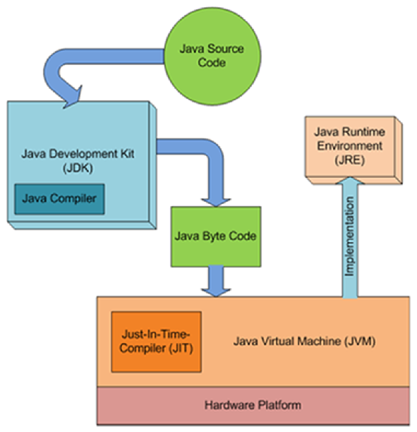
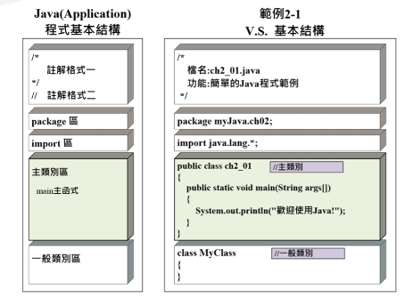

# HelloWorld

## JVM、JDK、JRE 關係



```java
package kenny
public class HelloWorld{
    public static void main(String [] args){
        System.out.println("Hello World");
    }
}
```

## JAVA 程式基本結構



## Class 類別

- 定義物件的一種型態，沒有實體，可以看成是建立 Java 物件的模板，包含物件的屬性和方法
- 名稱第⼀個字⺟習慣⽤用⼤寫
- 命名與檔名相同
- 括弧使用 `{ }`，代表的是 class 裡的頭跟尾，中間包含的就是屬性和方法

```java
class HelloWorld{

}
```

## Method 方法

- ⼀切從 `main` 開始，不管其他程式寫在 main 前面還是後面都是由 main 先開始，它列出了程式的任務
- 最重要的就是 input(輸入值) 和 output(回傳值)
- 沒有回傳值 `void`
- 輸入參數 String []args

```java
static void main(String []args)
```

## 修飾⼦

- 存取權限修飾⼦(Access Control Modifiers)

    `public` : 對所有類別可見

- 非存取權限修飾⼦子(Non-Access Modifiers)：

    `static`：用來修飾類別方法和類別變數

```java
public static void main(String args[]){

}
```

## 終端機模式執行JAVA

- 先進入到置放程式的檔案夾
- 輸入 `javac filename.java`，該資料夾會出現以檔案名稱命名的 `.class`檔案

    filename指的是要運行的程式名稱

- 最後再輸入 `java filename` ，即可執行該程式
- 假如執行程式放置在 package 裡，則指令應該為 `packagename.filename`來執行該程式