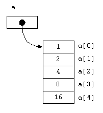

# 字串與陣列

## 陣列

簡單來說，陣列就像抽屜⼀格⼀格存放資料，是一種儲存大量同性質資料的環境，並且會在記憶體中以連續空間存放。由於不必使用不同的變數名稱，以及陣列元素存取的方便性，因此大多數程式設計皆會採用
語法：

```java
資料型態 陣列名稱[];
或
資料型態[] 陣列名稱;
```

範例：

```java
int[] num = {1,2,4,8,16};
int a = num[2];
```



陣列中的每個元素相當於一個變數，透過索引(index)，JAVA 的**陣列索引由 0 開始計算**，即可直接取得陣列元素

    - 宣告陣列名稱並產生陣列物件，並指定陣列長度
      語法：
      
      ```java
      資料型態 陣列名稱[] = new 資料型態 [元素個數];
      ```

      範例：

      ```java
      int[] num = new int[5];
      num[0] = 1;
      num[1] = 2;
      ```

## 多維陣列

陣列若具有多個索引稱為多維陣列
以下圖為例，語法如下：


```java
int[][] = new int[3][3];
int[0][0] = 1; //第一格第一個位置，以下以此類推
int[0][1] = 2;
int[0][2] = 3;
………
int[2][0] = 7;
int[2][1] = 8;
int[2][2] = 9;
```

多維陣列一開始給初始值範例：

```java
int [][] multi = {{1,2},{3,4,5}};
		
System.out.println(multi[1][2]);
```

## 陣列複製

- `System.arraycopy()`

語法：
```java
System.arraycopy(src, srcPos, dest, destPos, src.length);
```

1. src：代表來源陣列
2. secPos：代表來源陣列索引
3. dest：代表目標陣列
4. destPos：代表目標陣列索引
5. src.length：代表要複製幾個元素

範例：
```java
int[] arr1 = {1, 2, 3, 4, 5};
int[] arr2 = new int[5];
 
System.arraycopy(arr1, 0, arr2, 0, arr1.length);
```

- `Arrays.copyOf`

語法：
```java
Arrays.copyOf(src, src.length)
```

1. src：代表來源陣列
2. src.length：代表要複製幾個元素

範例：
```java
int[] num1 = new int[]{1,2};
int[] num2 = Arrays.copyOf(num1, 2);
```

## 字串

- 字串與字元的關係：字串就是字元的陣列 `char []`

範例：
```java
char[] c = {‘a’,’b’,’c’};
String s = “abc”;
System.out.println( c );
```

`charAt(int index)`：指定字串的位元

```java
String str = “abc”;
str.charAt(1);
```

- `split(String regex)`：用來將字串分割為數個字串，回傳值為字串陣列

範例：
```java
String str = "id, name, age";
String [] sAray = str.split(",");
System.out.println(sAray[1]);
```

- `substring(int beginIndex)`和`substring(int beginIndex, int endIndex)`：依據指定的位置取回⼦字串

範例：
```java
String str = "abcdef";
System.out.println(str.substring(0, 4));
```

- `indexOf(String str)`：回傳第⼀個⼦字串的索引值

- `lastIndexOf(String str)`：回傳最後一個子字串的索引值

- `contains(CharSequence s)`：是否包含某一個字串，回傳為boolean值

範例：
```java
String index = "aabbccdd";
System.out.println(index.indexOf("b"));
System.out.println(index.lastIndexOf("b"));
System.out.println(index.contains("a"));
```

- `replace(CharSequence a, CharSequence b)`：將字串中的 a 替換成 b

範例：
```java
String str = "abcABC123";
System.out.println(str.replace("a", "e"));
```

> 正規表示法(Regular Expression)：使⽤單個字串來描述、符合一系列某個句法規則的字串

**可以查詢 `javaAPI` 裡的 `java.util.regex.Pattern` 看正規表示法的語法**

- `replaceAll(String regex, String replacement)`：使⽤正規表示法替換掉所有的字串

範例：
```java
System.out.println(str.replaceAll("\\d", "!"));
System.out.println(str.replaceAll("[a-zA-Z]", "!!!"));
```

- `startsWith` 跟 `endsWith`

範例：
```java
String str = "abc";

//startwith
System.out.println(str.startsWith("b"));

//endwith
System.out.println(str.endsWith("c"));
```

- `equals`：字串比較

範例：
```java
String str1 = "abc";
String str2 = "def";

//equals
System.out.println(str1.equals(str2));
```