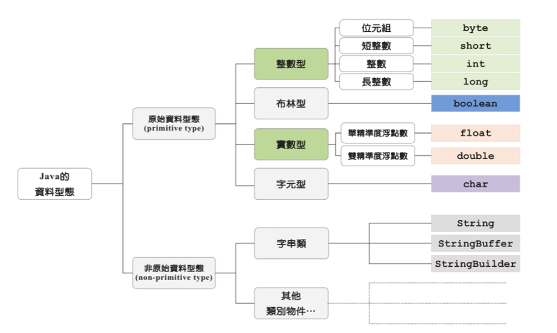
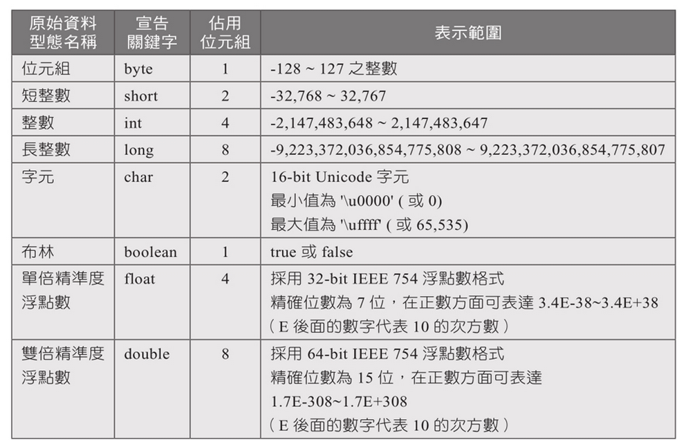
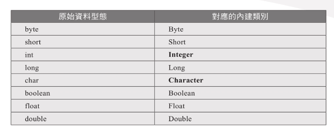

# 變數、資料型態、運算子

## Variable 變數

- 變數是一個我們自⼰定義的名稱，它可以代表一個數值、一串⽂字或是⼀個物件，習慣上變數都是小寫
- 宣告變數：在Java語言中，所有的變數在使用前必須宣告，語法中的「=」，是將右邊的值賦予給左邊的變數，最後以分號作為語法的結束
  基本格式：

```java
String name = “Amy”;
int age = 21;
```
  
- 物件屬性(全域變數) & 區域變數

    `物件屬性`：可提供給其他物件使⽤，宣告在 class 層中，不⽤給初始值，可提供給方法(method)使⽤，但必須在方法之外，有修飾子
    `區域變數`：在 void 層宣告，不可以提供給其他物件使⽤，亦不可以提供給其他方法使⽤，必須要給初始值，沒有修飾子


- Java 程式語言的變數需要宣告之前，必需給予一個型態，可分為兩種：
    1. 基本資料型態(primitive data type)：共8種
    2. 類別型態：開頭字母為大寫
   
```java
package kenny

public class Demo4_1；{

    //物件屬性
    public static String gender;
    public static void main(String [] args){
        //類別型態變數
        String name = "Kenny";
        //基本資料型態變數
        int age = 21;

        gender = "male";

        System.out.println("My name is " + name + ", I'm " + age + " years old. And I'm a " + gender);

    }
}
```

## 基本資料型態

- Java 的所有資料型態





- Overflow (溢值)：當某個變數的大小超過所能表示的範圍時，將會產生溢位

- 整數型態：

```java
package kenny;

public class Demo4_2 {

	public static void main(String[] args) {
		// TODO Auto-generated method stub
		int up = 4;
		int down = 6;
		int height = 5;
		
		int area = (up+down)*height/2;
		
		System.out.println(area);
	}
```

- 實數型態：

```java
package kenny;

public class Demo4_3 {

	public static void main(String[] args) {
		// TODO Auto-generated method stub
		int pv = 10000;
		double i = 0.0084;
		int n = 12;
		
		double fv = pv * Math.pow((1+i), n);
		
		System.out.println("未來財富："+ fv);
	}

}
```

- 字元、布林值型態：
  `char`：亦可以透過 ASCII CODE 來給值

```java
package kenny;

public class Sample4_4 {

	public static void main(String[] args) {
		// TODO Auto-generated method stub
		char a = 'z';
		//使用ASCII CODE 來給值
		char c = 67;
		
		boolean b = true;
		
		System.out.println(a);
		System.out.println(c);
		System.out.println(b);
	}

}
```

## 運算子

- 算術運算子
    `+`：加
    `-`：減
    `*`：乘
    `/`：除
    `%`：取餘數
    `++`：+1遞增
    `--`：-1遞減
    `a+=b`：a=a+b
- 比較運算子
    `==`：等於
    `！=`：不等於
    `>`：大於
    `<`：小於
    `>=`：大於等於
    `<=`：小於等於

- 邏輯運算子
    `!`：NOT
    `&&`：AND
    `| |`：OR

- 三元條件運算子
    `?:`：條件式 `?` 成立回傳值 `:` 失敗回傳值

```java
package kenny;

public class Sample4_6 {

	public static void main(String[] args) {
		int a = 4;
		int b = 3;
		
		//取餘數
		System.out.println(a%b);
		//a遞增
		System.out.println(a++);
		//b遞減
		System.out.println(b--);
		//a+=b 等同 a=a+b
		System.out.println(a+=b);
		//大於
		System.out.println(b>a);
		//等於
		System.out.println(a==b);
		//不等於
		System.out.println(a!=b);
		//三元運算
		System.out.println(a<b ? "yes":"no");
		//邏輯運算
		System.out.println(true && false);
		System.out.println(true || false);
		System.out.println(!true);
		
		
	}

}
```


## 資料型態轉換

型態轉換發生在運算子左右兩邊的運算元型態不同時

- 強制型態轉換：將資料型態強制轉換成另一種型態的語法
    格式：(type)value type;

```java
package kenny;

public class Sample4_5 {

	public static void main(String[] args) {
		// TODO Auto-generated method stub
		int i = 10;
		long l = (long)i;
		
		System.out.println(l);
	}

}
```

- 編譯器強制型態轉換：程式中的整數預設為int，浮點數預設為double，因此需要告訴編譯器⽤ long、float 配置長度

```java
package kenny;

public class Sample4_5 {

	public static void main(String[] args) {
				
		long j = 2345678901L;
		float k = 3.14F;
		
		System.out.println(j);
		System.out.println(k);
	}

}
```

- 自動型態轉換
  Java會在下列條件皆成立時，自動做資料型態的轉換：
  1. 轉換前的資料型態與轉換後的型態相容
  2. 轉換後的資料型態之表示範圍比轉換前的型態大
    例如： int 和 float 相加，int 會被轉成 float
    char 和 int 相加，char 會被轉成 int

- 基本資料型態與對應的內建類別：Java 中有兩種型態系統，基本型態與類別型態，使用基本型態目的在於效率，然而更多時候，會使用類別型態建立實例，因為物件本身可以攜帶更多資訊



- 包裹型態（Wrapper Types）
  要讓基本型態像物件一樣操作，可以使用 Long、Integer、Double、Float、Boolean、Byte 等類別型態來包裹（Wrap）基本型態，用 new 來建構一個實例的物件

```java
package kenny;

public class Sample4_5 {

	public static void main(String[] args) {
		// TODO Auto-generated method stub
		Double d = new Double (3.14);
		System.out.println(d.SIZE);
		System.out.println(d.intValue());
	}

}
```

- ⾃動裝箱(autoboxing, unboxing)
    編譯器⾃動將基本資料型態轉換為物件

```java
package kenny;

public class Sample4_5 {

	public static void main(String[] args) {
				// Autoboxing
				double d3 = 3.14;
				Double d4 = d3;
				System.out.print("d4:"+d4);
				
				// Unboxing
				Double d5 = new Double(3.14);
				double d6 = d5;
				System.out.println(d6);
				
				// Autoboxing Error
				Double d7 = null;
				double d8 = d7;
				System.out.println(d8);
	}

}
```

自動裝箱與拆箱的功能是所謂的「編譯器蜜糖」（Compiler sugar），雖然使用這個功能很方便，但在程式運行階段您還是瞭解 Java 的語義，例如下面的程式是可以通過編譯的，這樣的語法在編譯時期是合法的，但是在運行時期會有錯誤

```java
package kenny;

public class Sample4_5 {

	public static void main(String[] args) {
			
				// Autoboxing Error
				Double d7 = null;
				double d8 = d7;
				System.out.println(d8);
	}

}
```

因為這種寫法相當於：

```java
package kenny;

public class Sample4_5 {

	public static void main(String[] args) {
			
				// Autoboxing Error
				Double d7 = null;
				double d8 = d7.doubleValue();
				System.out.println(d8);
	}

}
```

- 物件之間轉換 `value Of()`：將基本資料型態轉換為物件

```java
package kenny;

public class Sample4_5 {

	public static void main(String[] args) {
		// TODO Auto-generated method stub
		double d1 = 3.14;
		Double d2 = Double.valueOf(d1);
		
		System.out.println(d2);
	}

}
```

- 基本資料型態轉字串： String.valueOf()

```java
package kenny;

public class Sample4_5 {

	public static void main(String[] args) {
		// String transfer to Primitive data type
		float a = 3.14f;
		
		String s = String.valueOf(a);
		
		System.out.println(s);
	}

}
```

- 字串轉基本資料型態，在資料型態前加上 `parse`

    `parseDouble()`
    `parseInt()`
    `parseFloat()`
    `parseLong()`
  
```java
package kenny;

public class Sample4_5 {

	public static void main(String[] args) {
		// String transfer to Primitive data type
		String a = "3.14";
		
		Double d = Double.parseDouble(a);
		
		System.out.println(a);
	}

}
```

## 註解

- 區塊註解 `/** ......... **/`：在 `/**` 與 `**/` 之間的所有文字(可跨行)都將被編譯器忽略，習慣會在隔行處多加上 `*` 來表明
- 單行註解 `//` ：凡是 `//` 之後的整行文字都會被視為註解

