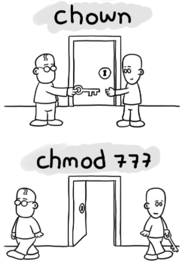
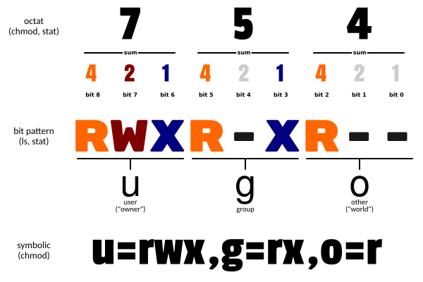

# Linux 文件基本屬性

## 用戶與權限

Linux 系統是一種典型的多用戶系統，不同的用戶處於不同的地位，擁有不同的權限
為了保護系統的安全性，Linux 系統對不同的用戶訪問同一文件（包括目錄文件）的權限做了不同的規定
在Linux 中我們通常使用以下兩個命令來修改文件或目錄的所屬用戶與權限：

- **chown (change owner)** ： 修改所屬用戶與組
- **chmod (change mode)** ： 修改用戶的權限

下圖中通過chown 來授權用戶，通過chmod 為用戶設置可以開門的權限



在 Linux 中我們可以使用 ll 或者 ls –l 命令來顯示一個文件的屬性以及文件所屬的用戶和組，如：

```sh
# ls - l
total 64 
dr - xr - xr - x    2 root root 4096 Dec 14 2012 bin    
dr - xr - xr - x    4 root root 4096 Apr 19 2012 boot
 ……
 ```

上面例子中，`bin` 文件的第一個屬性用 `d` 表示。 `d`在 Linux 中代表該文件是一個目錄文件
在Linux 中第一個字符代表這個文件是目錄、文件或鏈接文件等等

- 當為 `d` 則是目錄
- 當為 `-` 則是文件
- 若是 `l` 則表示為鏈接文檔 (link file)
- 若是 `b` 則表示為裝置文件裡面的可供儲存的接口設備(可隨機存取裝置)
- 若是 `c` 則表示為裝置文件裡面的串行端口設備，例如鍵盤、滑鼠 (一次性讀取裝置)

## chmod 命令

Linux/Unix 的文件調用權限分為三級：文件所有者（Owner）、群組（Group）、其它用戶（Other Users）
字符中，以三個為一組，且均為 rwx 的三個參數的組合。其中，`r`代表可讀 (read)、`w`代表可寫(write)、`x`代表可執行 (execute)。要注意的是，這三個權限的位置不會改變，如果沒有權限，就會出現`-`而已


字符中，以三個為一組，且均為 rwx 的三個參數的組合。其中， r 代表可讀 (read)、 w 代表可寫(write)、 x 代表可執行 (execute)。要注意的是，這三個權限的位置不會改變，如果沒有權限，就會出現 - 而已
以八進制如下圖，754 將這樣解釋：

- 所有者的權限用數字表達：擁有者的那三個權限的數字加起來的總和。如rwx ，也就是4+2+1 ，應該是7
- 群組的權限用數字表達：所屬群組的那個權限數字的相加總和。如 r-x ，也就是4+0+1 ，應該是5
- 其它用戶的權限數字表達：其它用戶權限的數字相加總和。如 r - - ，也就是4+0+0 ，應該是4



語法：

```sh
chmod [- cfvR ] [-- help ] [-- version ] mode file ...
```

參數說明：

- `-c` : 若該文件權限確實已經更改，才顯示其更改動作
- `-f` : 若該文件權限無法被更改也不要顯示錯誤訊息
- `-v` : 顯示權限變更的詳細資料
- `-R` : 對目前目錄下的所有文件與子目錄進行相同的權限變更(即以遞歸的方式逐個變更)
- `--help` : 顯示輔助說明
- `--version` : 顯示版本

```sh
chmod [ ugoa ...][[+-=][ rwxX ]...][,...]
```

- `u` 表示該文件的擁有者， `g` 表示與該文件的擁有者屬於同一個群組 (group) 者， `o` 表示其他以外的人， `a` 表示這三者皆是
- `+` 表示增加權限、 `-` 表示取消權限、 `=` 表示唯一設定權限
- `r` 表示可讀取， `w` 表示可寫入， `x` 表示可執行， `X` 表示只有當該文件是個子目錄或者該文件已經被設定過為可執行

舉例：

```sh
chmod a = rwx file
```

等同於

```sh
chmod 777 file
```

## chown 命令

Linux chown（change owner）命令用於設置文件所有者和文件關聯群組的命令
Linux/Unix 是多人多工操作系統，所有的文件皆有擁有者。利用 chown 將指定文件的擁有者改為指定的用戶或群組，用戶可以是用戶名或者用戶 ID，群組可以是群組名或者群組 ID
chown 需要超級用戶 `root` 的權限才能執行此命令
語法：

```sh
chown [- cfhvR ] [-- help ] [-- version ] user [: group ] file ...
```

- user：新的文件擁有者的使用者 ID
- group：新的文件擁有者的使用者群組 (group)
- c：顯示更改的部分的信息
- f：忽略錯誤信息
- h：修復符號鏈接
- v：顯示詳細的處理信息
- R：處理指定目錄以及其子目錄下的所有文件
- -help：顯示輔助說明
- -version：顯示版本

實例：
將文件file1.txt 的擁有者設為 user，群組 usergroup :

```sh
chown user:usergroup file1.txt
```

將當前前目錄下的所有文件與子目錄的擁有者皆設為 user，群組 usergroup：

```sh
chown - R user:usergroup *
```

## chgrp 命令

Linux chgrp（change group）命令用於更改文件或目錄的所屬群組
與 chown 命令不同，chgrp 允許普通用戶更改文件所屬的群組，只要該用戶是該群組的一員
在 UNIX 系統家族裡，文件或目錄權限的掌控以擁有者及所屬的群組來管理。可以使用 chgrp 指令去更改文件與目錄的所屬類別，設置方式採用名稱或分區識別碼皆可
語法：

```sh
chgrp [-cfhRv] [-help] [-version] [所屬分類] [文件或目錄...]或chgrp [-cfhRv] [-help] [-reference = <參考文件或目錄> ] [-version] [文件或目錄...]
```

參數說明：

- -c 或 --changes：效果類似 `-v` 參數，但僅回收更改的部分
- -f 或 --quiet 或 --silent：不顯示錯誤信息
- -h 或 --no-dereference：只對符號連接的文件作修改，而不是更動其他任何相關文件
- -R 或 --recursive：遞歸處理，將指定目錄下的所有文件及子目錄一併處理
- -v 或 --verbose：顯示指令執行過程
- --help：在線幫助
- --reference = <參考文件或目錄>：將指定文件或目錄的所屬類別全部歸為一體和參考文件或目錄的所屬類別相同
- --version：顯示版本信息