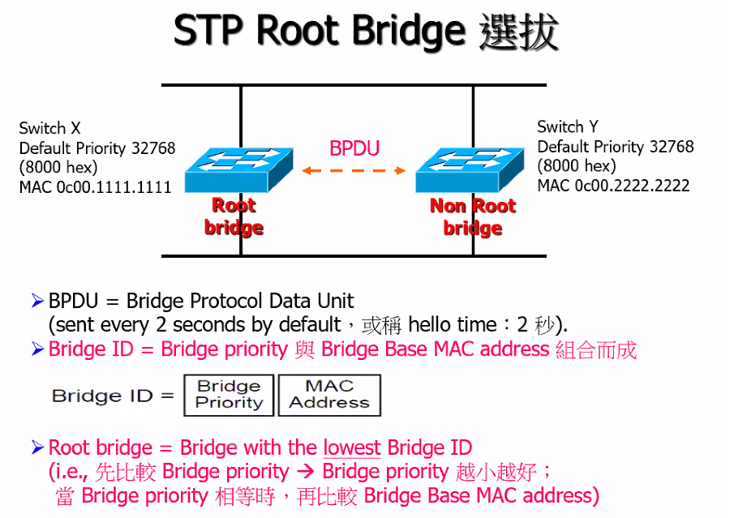
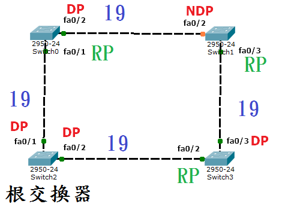

# STP (IEEE 802.1D)

## 應用場景

在二層交換網絡中，一旦存在迴圈就會造成封包在迴圈內不斷循環和增生，產生廣播風暴，從而佔用所有的有效頻寬，使網絡變得不可用，使用擴展樹演算法(Spanning-Tree Algorithm, STA)建立拓樸資料庫，然後搜尋並關閉冗餘鏈路

## 核心名詞

- 根橋接器 (root bridge) 

STP 網路中的交換器會選舉出 root bridge，網路中所有決定—例如哪個 port 要凍結，哪個 port 要設在轉送模式，都是從根橋接器的觀點來進行的。一旦選舉出根橋接器後，所有其他橋接器都必須建立通往它的最佳路徑，而有最佳路徑的通訊 prot 就稱為 root port (根埠)

- 非根橋接器

根橋接器以外的所有橋接器。非根橋接器會與所有其他橋接器交換 BPDU，並且更新所有交換器上的 STP 拓樸資料庫，這樣可以防範迴圈，並且有助於因應鏈路的故障

- BPDU (Bridge Protocol Data Unit )

每台交換器會比較它們透過BPDU傳送給鄰居、以及從鄰居收到的參數。BPDU裡面放的是橋接器ID

- 橋接器 ID (Bridge ID)

STP 用 Bridge ID 來追蹤網路中的所有交換器。它是由橋接器的優先序 (所有Cisco交換器上的預設是32768) 與 MAC 共同決定的。可以藉由將特定交換器的優先序設定為低於預設值，強制該台裝置成為根橋接器

- 埠成本 (port cost)

當兩部交換器之間有多條鏈路時，以埠成本來決定最佳路徑。成本由頻寬所決定

- 路徑成本 (path cost)
 
交換器可能有多條路徑通往 root bridge。將個別路徑上遇到的 port cost 相加可得到該路徑的成本

### bridge port 角色

- 根埠 (root port)

若有多條線路到 RB (root bridge) ，則可以藉由檢查每條線路的頻寬來找出 port cost。最低成本port 就是 RP (root port)，如果有多條線路達到相同裝置，則使用連到上游交換器中最小 port 號者，RB 自己沒有 RP，但其他所有交換器都必須且只能有1個 RP

- 委任埠 (designed port)

具有通往特定網段、特定 segment 最低成本的 port。DP (designed port) 會被標示成轉送埠 (forward port)，且每個網段只能有一個轉送埠

- 非委任埠 (none-designed port)

成本比DP高的 port，決定完RP、DP後剩下來的 port。NDP (none-designed port) 會被放入凍結模式 (blocking mode) 或丟棄模式，**NDP不會是轉送埠**

- 轉送埠 (forwarding port)

可轉送封包，可以是 RP 或 DP

- 凍結埠 (blocked port)

不會轉送封包，用來預防迴圈；但仍會聆聽 BPDU 封包，並且丟棄所有封包

- Cisco快速擴展樹協定 (RSTP)

STP (IEEE802.1D) 的收斂時間約為 30 秒因為在 Port State 轉換需要 Timer (計數器)，所以收斂時間較長，因此出現了 RSTP(Rapid STP IEEE802.1w)，在 RSTP 的 Port State 轉換是用 Proposal and Agreememt (主動協商) 所以收斂時間較快。在 RSTP Port Role 中將 NDP 用 Alternate Port與 Backup Port 取代

- 替代埠 (alternate port)

對應到 802.1d 的凍結狀態，也是 802.1w (RSTP) 所使用的名詞，當LAN網段上連接不只一台交換器，且其中一台交換器持有DP時，另一台交換器連接該網段的埠即是替代埠。(備援埠在別人身上)

- 備援埠 (backup port)

對應到 802.1d 的凍結狀態，也是 802.1w (RSTP) 所使用的名詞。當交換器有一個連到 LAN 網段上的 port 是 DP 時，若有另一個連到同網段的 port 就是備援埠。(備援埠在自己身上)

## STP流程

1. 選擇 Root Bridge

橋接器 ID 長度為 8 個位元組，包括裝置的優先序與 MAC 位址，如圖所示。IEEE 802.1d 之預設優先序為 32768
如果兩部交換器優先序一樣，則比較 MAC 誰最低。下圖中的兩台交換器優先序同為預設值，所以用 MAC 來判斷。交換器 X 成為根橋接器
在選出根橋接器之前，橋接器每 2 秒就會從所有作用中的埠送出 BPDU，為根橋接器的選舉依據

2. 選擇 RP：先比 path cost 再比 BID (Bridge ID)  最後比 PORT-PRIORITY

- 先看 S3 中 fa0/3 到 Root Bridge 的路徑 S3→S1→S0→S2，每前每個路徑的速度為100M (Fast Ethernet)，所以 fa0/3 的Path Cost=19+19+19=57，Port Cost=19；同樣的算法，S3 的fa0/2 Path Cost=19，Port Cost=19，故  fa0/2 選為 RP。
p.s.若將 fa0/2 改為 speed 10M 則其Port Cost=100，Path Cost=100

- 路徑成本相同
當一台交換器到達 Root Bridge 的多個埠 Path Cost 相同時，要比較該埠 Upstream 的交換器的 BID & Port ID。以 S1 為例，fa0/2 及 fa0/3 的路徑成本相同，再來比較往上接的交換器 BID，fa0/2→S0，fa0/3→S3，比較 S0 & S3 的BID，假如 S3 的 BID/MAC 較小，則 fa0/3 選為RP

- 比較 Port-priority 
當一台交換器同時兩埠直連到另一台交換器時，Path Cost 相同、Upstream BID 也相同時，就只能比往上接的 Port-priority，Port-priority 以 Port ID 值比較，故對面是 fa0/1 及 fa0/2的狀況下，會以對 fa0/1 的當RP。
**※Port-priority預設值為128，可調整。用show spanning-tree會看到，格式為128.x，x 為Port-ID**

3. 選擇 DP

原則為每個 segment 中只有一個DP，同 LAN 區段內交換器間到達根交換器的最小路徑成本，較小者為 DP，若路徑成本相同則為 DP 為 BID 較小者

範例：
先把除了 RP 之外的連接埠全部設為 DP，又一個 segment 只有一個 DP，所以 RP 的對面一定是 DP。最後剩下 LAN 兩邊都是 DP 再來做比較。
如圖中的S0 fa0/2 & S1 fa0/2
首先兩個埠比較 Path Cost，S0有 19 & 57，S1 有兩個 38。19 比 38 小，故 S0 fa0/2 為DP，S1 fa0/2 為 NDP。

**※NDP有很多，但每台 Non-Root 交換器只有一個 RP，以及每個 Segment 只有一個 DP**
**※可將 DP 視為送出 BPDU 的埠，而 RP 則是接收 BPDU 的埠**
