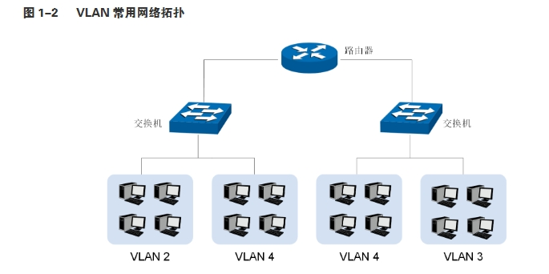
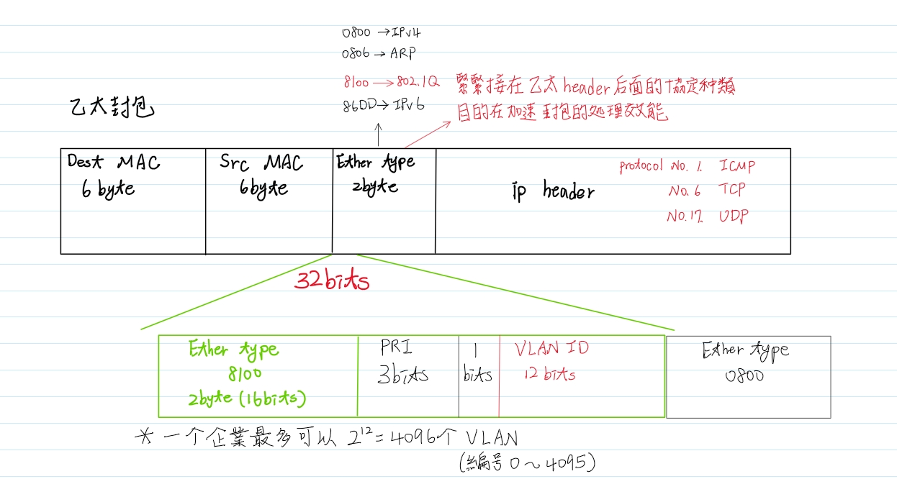
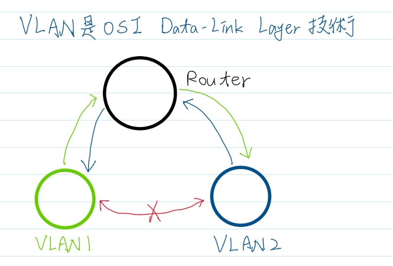
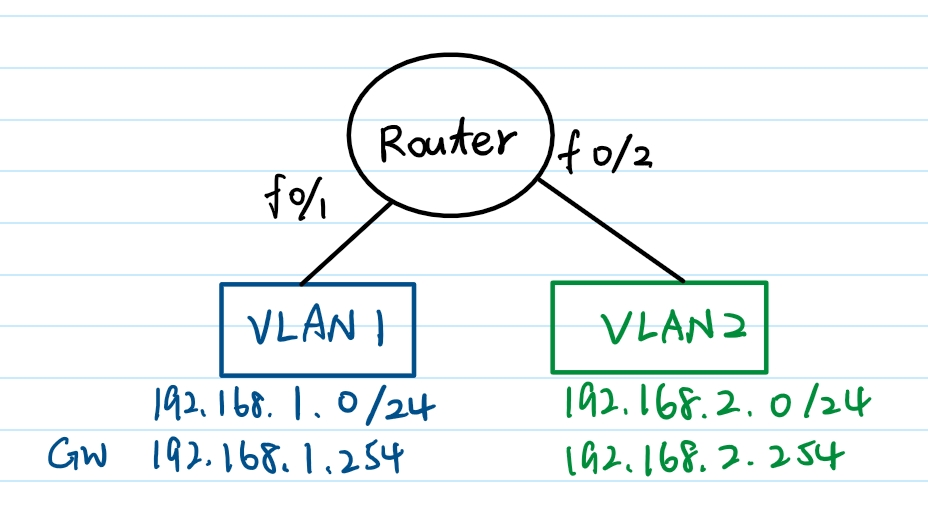
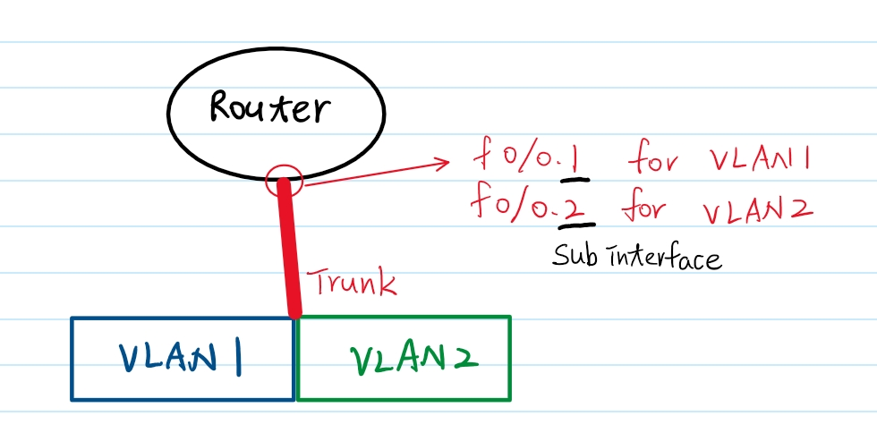
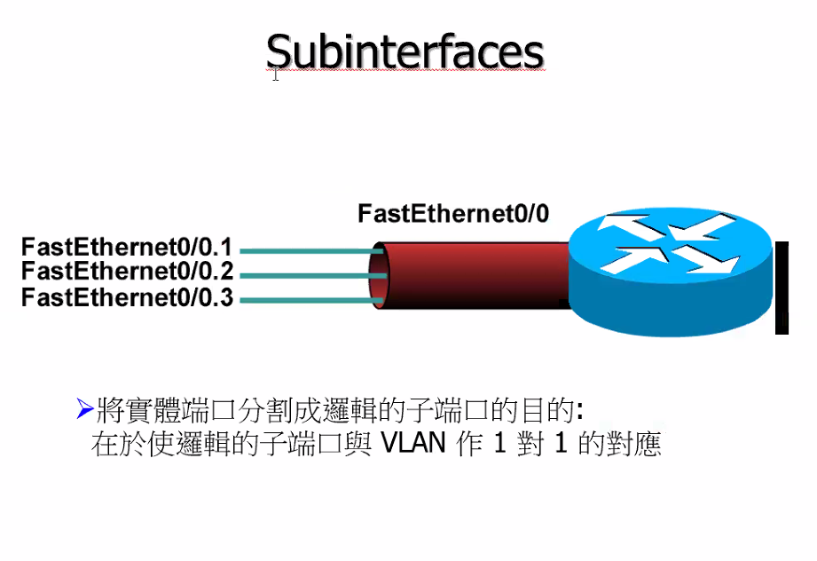

# VLAN

## 應用場景

當大型企業組織需要進行整體網路設計，而管理人員希望將整個大型網路區分成幾個小型的網段，每個網段都能針對不同的使用者，例如工程師應該存取同一個網段的網路，而銷售人員可能會存取另一個不同網段等等。<br>
VLAN技術就可以應用在這樣的環境之下，利用VLAN區分不同的網段，將工程師全部分到同一個VLAN中，而把銷售人員都分到另一個相同的VLAN中，這樣就不用牽扯到實體的網路連線而達到網段區分的效果。當然也可以根據公司裡的各個單位來區分網段，或是根據各種其他的區分條件而做不同的設定。

## 核心名詞

- Virtual Local Area Network (VLAN)
    - VLAN技術允許網路管理者將一個物理的LAN邏輯地劃分成不同的廣播域（或稱虛擬LAN，即VLAN）
    **A VLAN = A broadcast**
    

- Trunk
    - Switch port 是結合實體埠的第二層介面。如果該交換機埠是 `access port`，則只能屬於一個VLAN；如果是 `Trunk port`，則可以屬於所有的 VLAN
    - Trunk 就是利用單一線路讓所有相對應 VLAN 互通(在此之前兩台 switch 的同 VLAN 要相連就要一條線兩個port，兩個vlan兩條線四個port，以此類推疊加)
    - Trunk上使用的協定：IEEE 802.1Q(dot1q)、Cisco ISL(CCNA不討論)
    - 原理：
    交換器為 L2 設備，主要辨識 Ethernet Header (乙太網表頭)，乙太網表頭中沒有 VLAN 的資訊，802.1Q 協定的主要功用就是將 VLAN ID 用 tag 方式加到乙太網表頭，用以區別資料該送到哪個 VLAN；當資料經過 Trunk 時，802.1Q 協定會將 tag 拿掉(untag)

- IEEE 802.1Q
是訊框加標的標準方法。插入一個4bytes欄位至訊框中，以識別VLAN。若要跨廠牌交換器間建立主幹鏈路，必須使用802.1q才能運作。重點在於12位元的VLAN ID，它的值可以到212-2(0和4095為保留VLAN)，代表802.1q的加標訊框可以攜帶4094個VLAN資訊。(VLAN ID 12bits)

    | Ether Type NO.    | Prtocol        | 
    |-------------------|----------------|
    | 0x0800            | IPv4           | 
    | 0x0806            | ARP            |
    | 0x86DD            | IPv6           |
    | 0x8100            | IEEE 802.1Q    |

    

    理論上可建立VLAN為1-4094，但實際**可建立的VLAN為1-1001，1、1002-1005為保留VLAN，不可變動**。編號超過1005的VLAN稱為延伸式VLAN；除非交換器設定為VTP，否則它們不會被儲存在資料庫中。(VLAN 1006-4095只有Cisco Core Switch可用)

    - Frame tagging(訊框加標)
    每部交換器收到訊框時必須先從訊框的標籤中識別出它的 VLAN ID，然後檢視過濾表中的資訊，看要如何處理該訊框。如果訊框抵達的是一部連有其他 Trunk port 的交換器，就會從 Trunk port轉送出去。當訊框抵達出口時，交換器就會移除 VLAN 識別子，所以目的裝置可以接收訊框，而不必瞭解他們的 VLAN 識別。另外如果使用802.1q的主幹通訊，它們同時支援加標與沒有加標的交通

- Inter Vlan Routing (IVR)
又稱為upstream routing(上行遶送)，由於 VLAN 隔離了 Layer 2 廣播域，也間接的隔離了各個 VLAN 之間的其他 Layer 2 流量交換，這樣導致屬於不同 VLAN 之間的用戶不能進行 Layer 2 的通信。



為了解決這樣的問題，衍生出三種方法

1. 通過路由器接上多個實體端口
在路由器上為每一個 VLAN 都配置一個實體端口連接。將不同 VLAN 分流到路由器上不同的邏輯端口中，再通過路由器進行路由的轉發，以實現 VLAN 之間的通信


2. 單臂路由
使用路由器的單一實體端口做 Trunk，此種做法需在該端口底下建立 Sub-interface 也就是邏輯子端口



 - Cisco 修改 Native VLAN 的單臂路由指令
 ```
Router(config-subif)# encapsulation dot1q x native
``` 

3. 通過三層交換實現
在三層交換機配置 VLAN 虛擬端口來實現 VLAN 之間的路由，每個 VLAN 配置一個虛擬端口並配置一個 IP 地址（用戶設備設置的匝道作為 VLAN 虛擬端口的 IP 地址）

- Native VLAN
Trunk port 的 Native VLAN 預設為 VALN 1，在 802.1Q 主幹協定中，當資料目的是 Native VLAN時，該資料經過 Trunk port 不用 tag，即沒有 tag 的資料都往 Native VLAN丟
有一種網路攻擊針對 Native VLAN 稱為 VLAN hopping，所以從資安角度來說會想辦法關閉Native VLAN 的功能，或是將未使用之 VLAN 作為 Native VLAN

    - 修改 Native VLAN 為其它 VLAN 指令
    ```
    Switch(config)# int f/x
    Switch(config-if)# switchport trunk native vlan x    
    #要注意另一台switch相對應的trunk port也要改native vlan，否則無法建立trunk
    ```

- VTP (VLAN Trunking Protocol)
是 Cisco 專利，主要用作 VLAN 管理，話說要在網路裡加入⼀個新的 VLAN，需要在該 VLAN Traffic 所經過的每⼀台 Switch 創建此 VLAN。使⽤ VTP 則可以實施中央管理，只需在⼀台 VTP Server 新增 VLAN，VLAN 資訊就會自動發怖到其他 Switch，其他 Switch 就會新增此 VLAN

    - Server mode：這是所有 Catalyst Switch 的預設模式。在 VTP 網域中至少要有一台伺服器，以便傳播 VLAN 資訊。此外這台交換器必須處於伺服器模式，以便在 VTP 網域中建立、新增、和移除 VLAN。VLAN 資訊必須要在伺服器模式下變動，而且在 Server mode 的 Switch 上所做的任何 VLAN 變動都會傳播到整個 VTP 網域。在 VTP Server mode 中，VLAN 組態是存放在交換器的 NVRAM 中
    - Client mode：在Client mode下的 Switch 會接收來自 VTP Server 的 資訊；最大差異在於它們不能建立、變動移除VLAN。VTP 伺服器傳送的 VLAN 資訊不是存放在 NVRAM—這很重要，因為它意味著當 Switch 重新開機或重新載入時，VLAN 的資訊會被刪除
    - Transparent mode：Switch 不會參與 VTP 網域或是分享它的 VLAN 資料庫，但是它們還是會透過設定的主幹鏈路轉送 VTP 。它們可以建立、修改、和移除VLAN，會保管自己的資料庫但不會與其它的交換器共享，VLAN 資料庫會保存在NVRAM中。但其實它只對本機有意義，透通模式的完整目標是要讓遠端交換器能透過不參與相 VLAN 指派的交換器，然後從VTP伺服器端接收到VLAN資料庫。
    - VTP要在交換器間溝通VLAN資訊，必須滿足下面4個要求：
    1. VTP 版本必須相同
    2. Switch 的 VTP 管理網域名稱必須相同
    3. 其中一台 Switch 必須設定為 VTP Server
    4. 視需要設定 VTP 密碼
    5. Switch 間必須為 **Trunk**

## VLAN 基礎設定相關指令
| 指令                                                                                                                                                                               | 說明                                                            |
| -------------------------------------------------------------------------------------------------------------------------------------------------------------------------------- | ------------------------------------------------------------- |
| Switch#show vlan<br>Switch#show vlan id xx<br>Switch#show interface trunk                                                                                                        | ．查詢現有vlan狀態，只能顯示access port<br>．查詢特定vlan狀態<br>．查詢trunk port狀態 |
| Switch#show int fx/x switchport                                                                                                                                                  | 查詢特定介面的vlan設定                                                 |
| Switch(conf)#vlan x<br>↑設定完要no shutdown<br>↑視情況給VLAN IP & Mask(如果要telnet switch的話)                                                                                               | 建立vlan編號x                                                     |
| Switch(conf-vlan)#name happy                                                                                                                                                     | 將vlan x命名為happy                                               |
| Switch#vlan database<br>Switch(conf)#vlan xx name yyy                                                                                                                            | 非主流配置vlan                                                     |
| Switch(conf-if)#switchport access vlan y                                                                                                                                         | 在fx/x介面下，指定該port到vlan y                                       |
| Switch(config)#interface range f0/1-2<br>Switch(config-if)#switchport access vlan XX<br>Switch(config)#interface range f0/3,f0/13<br>Switch(config-if)#switchport access vlan XX | 一次加入多個介面到vlan                                                 |
| Switch(conf-if)#switchport voice vlan z                                                                                                                                          | 將該介面指定到voice vlan z(要先建立z)                                    |
| Switch#del flash:vlan.dat<br>Switch#reload                                                                                                                                       | 清除原有vlan database                                             |
| Switch(config-if)#ip address dhcp                                                                                                                                                | VLAN使用DHCP                                                    |
| Switch#show dhcp lease                                                                                                                                                           | 承上，查詢DHCP狀態                                                   |


## Trunk相關指令

| 指令                                                                                                                                                                                    | 說明                                                              |
| ------------------------------------------------------------------------------------------------------------------------------------------------------------------------------------- | --------------------------------------------------------------- |
| Switch(config)#int fx/x<br>Switch(config-if)#switchport trunk encapsulation dot1q<br>Switch(config-if)#switchport mode trunk                                                          | 設定fx/x介面為trunk port<br>#在較新的IOS版本可省略dot1Q那行                     |
| Switch(config-if)#switchport trunk allowed vlan y<br>Switch(config-if)#switchport trunk allowed vlan remove y<br>△y可以設定範圍比如4-8<br>Switch(config-if)#switchport trunk allowed vlan all | 讓特定vlan通過trunk<br>讓特定vlan不能通過trunk<br> <br>讓所有vlan通過trunk(回復預設) |
| Switch(config-if)#switchport trunk native vlan y<br>#no switchport trunk native vlan →復原                                                                                              | 修改trunk port的native vlan (要802.1q)<br>#trunk的兩邊都要修改才能溝通         |
| Switch#show int f0/24 switchport                                                                                                                                                      | 查詢fx/x是否為Trunk Port                                             |
| Switch#show interface trunk<br>Operational mode：目前的trunk模式                                                                                                                            | 查詢trunk資訊<br>查詢有哪些是trunk port與哪些vlan可通                          |
| Switch#traceroute ip                                                                                                                                                                  | 查詢路由是否有經過Trunk                                                  |
