# Spring Core

## Why Spring

- 用於構建 Java 應用程序非常流行的框架
- 是 J2EE 更簡單和輕量級的替代品
- 提供大量的輔助……讓事情變得更容易

## Java EE 演進

## Java EE & Spring

## Spring 5

- 使用 Java 8 或更高的版本
- 棄用舊版集成：Tiles、Velocity、Portlet、Guava 等
- 升級 Spring MVC 以使用新版本的 Servlet API 4.0
- 添加了新的反應式編程框架：Spring WebFlux

## Spring 框架概述

- 使用 Java POJO (Plain-Old-Java-Objects) 進行輕量級開發
- 依賴注入(Dependency Injection) 將物件的建立、物件的儲存、物件的管理交給了 Spring 容器
- 宣告使用 Aspect-Oriented-Programming (AOP) 面向切面編程
- Core Container（核心容器）：Spring 的其他一切元件都是建立在此基礎之上的，包含有 Beans、Core、SpEL(Spring Expression Language) 和 Context 

    

- Web Layer：Spring MVC的主要模組，包括 Servlet、WebSocket、Web 和 Portlet 模塊

    

- Data Access Layer：Spring的資料訪問模組，提供對JDBC、Hibernate等資料訪問的支援和整合，包括JDBC、ORM、Transactions、OXM、JMS 模塊

    

- Infrastructure：包含 AOP、Aspects、Instrumentation 以及 Messaging 模塊

    

- Test Layer：包含JUint等測試單元的支援

    

## Inversion of Control (IoC)

- 概念圖：

- 主要功能：
    - 創建和管理物件（控制反轉）
    - 依賴注入 (Dependency injection)

- Spring 開發流程
    1. 配置你的 Spring Beans 於 xml 檔

   

   2. 創建一個 Spring 容器
        - Spring 容器一般稱為 ApplicationContext
    
    

    3. 從 Spring 容器中檢索 Beans

    

## What is a Spring Bean

- Spring Bean 只是一個簡單的 Java 物件
- 當 Java 物件由 Spring Container 創建時，Spring 將它們稱為 “Spring Beans”
- 綜上所述，每當看到 Spring Bean 時，就聯想到 Java 物件

### Dependency Injection

- 給予調用方它所需要的事物，「Dependency」是指可被方法調用的事物。「Injection」是指將「Dependency」傳遞給調用方的過程
    示意圖：

    

- Injection Types：Spring 有多種注入方式最常見的兩種為 Constructor Injection、Setter Injection
- Constructor Injection 開發步驟：
    1. 定義 dependency interface 和 class

    

    2. 在 class 中創建一個用於 injections 的構造函數

    

    3. 在 Spring 配置文件中配置 dependency injection

     
   
- Spring 如何處理配置文件

    

- Setter Injection 是透過 Inject dependencies 方式來呼叫 class 的 set 方法，開發步驟如下：
    1. 在 class 中創建 setter 方法進行注入

    

    2. 在 Spring 配置文件中一步步配置 Dependency Injection

     

- Injecting Literal Values 步驟：
    1. 在 class 中創建 setter 方法進行注入

    

    2. 在 Spring 配置文件中配置 setter 注入

    

    3. 以 Properties File 值作為依據

    

### Bean Scopes 

- Default Scope：Singleton
    - Spring Container 預設只創建一個 bean 的 instance
    - 它緩存在記憶體中，之後不再創建
    - 所有對該物件的引用都共享這個 instance

範例：

- 明確指定 Bean 範圍

- 額外的 Spring Bean 範圍

- Prototype Scope ：每次調用或請求這個 bean 都會創建一個新的 instance

### Bean Lifecycle Methods

- Bean Lifecycle

- Bean Lifecycle Methods
    - 可以在 bean 初始化以及銷毀期間添加自定義的 code，像是自訂的邏輯方法或是資源調用(例如：資料庫、檔案、socket)

    初始化範例：

    

    銷毀範例：

    

- 開發步驟：
    1. 定義 init 和 destroy 的方法
    2. 在 Spring 配置文件中配置方法名稱
    
## Annotations Overview

### Java Annotations

- 添加到 Java class 的特殊標籤/標記
- 提供有關 class 的中繼資料(meta-data)
- Annotion (註解) 是一個介面，程式可以通過反射來獲取指定的 Annotion 物件，然後通過 Annotion 物件來獲取註解裡面的中繼資料

- 為什麼 Spring 配置帶有 Annotations？
    - XML 配置可能很冗長
    - 使用 Annotation 配置 Spring bean
    - Annotation 最大限度地減少了 XML 配置

- 掃描 Component Classes
    - Spring 將掃描 Java class 以查找特殊 Annotation
    - 自動註冊 bean 到 Spring container

- 開發步驟：
    1. 在 Spring 配置文件中啟用掃描 Component Classes
    
    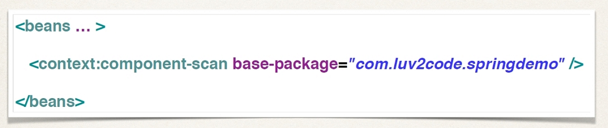

    2. 將 @Component Annotation 添加到 Java class

    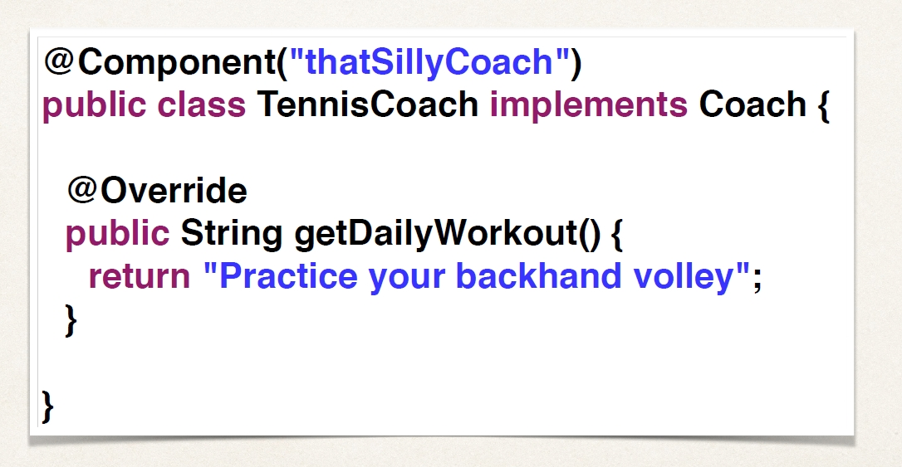

    3. 從 Spring container 中檢索 bean

    

- @Components 預設 Bean ID 名稱為 class 名稱，首字母為小寫

### Dependency Injection with Annotations and Autowiring

- 什麼是 Autowiring？
    - 可以自動連接 dependency injection、Spring
    - Spring 會尋找匹配屬性的 class
    - Spring 會自動 inject

- Autowiring Injection 型態
    - Constructor Injection 開發步驟：
        1. 定義 dependency 的 interface 和 class

        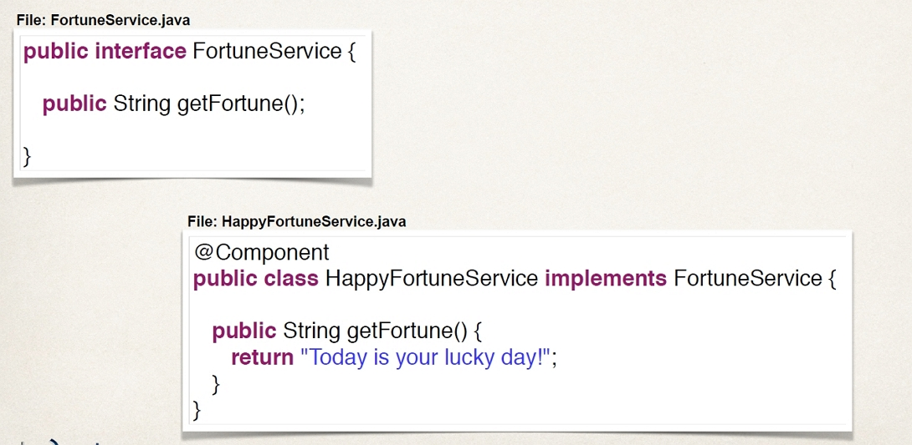

        2. 在 class 中創建一個 Constructor Injection

        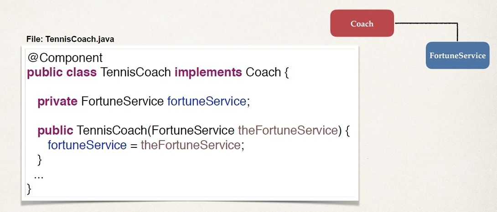

        3. 使用@Autowired Annotation 配置 Dependency Injection

        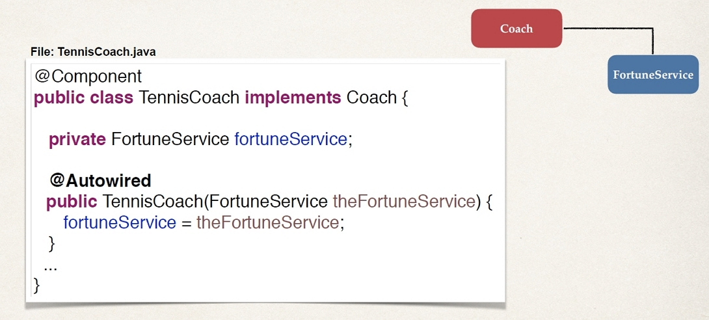

    - Setter Injection 開發步驟
        1. 在 class 中創建 setter 方法進行注入

        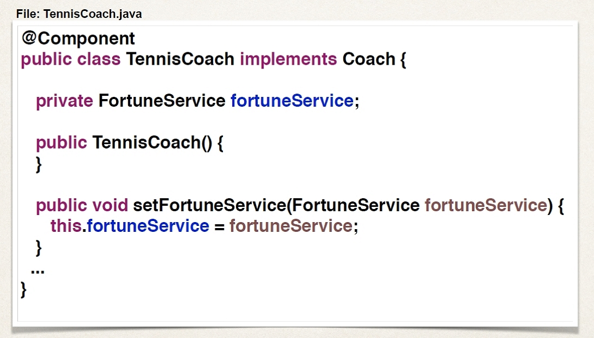

        2. 使用 @Autowired Annotation 配置 Dependency Injection

        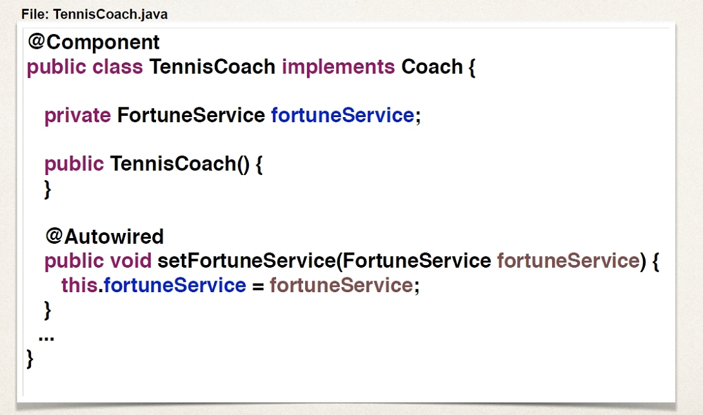

    - Field Injections 開發步驟
        1. 使用 Autowired Annotation 配置 Dependency Injection，不須使用 setter 方法，直接調用變數

        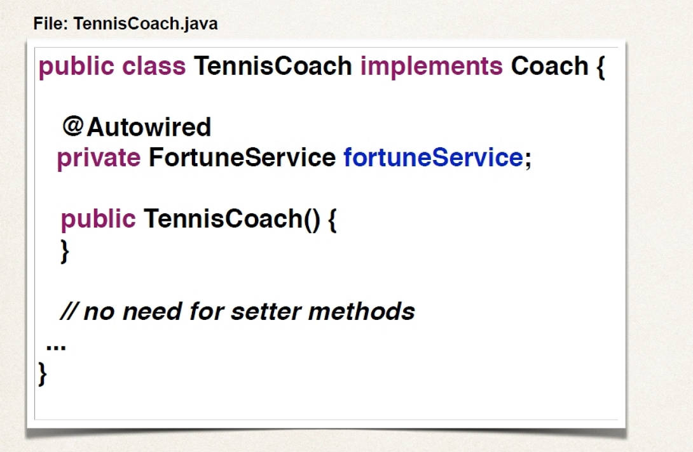

- Annotation Autowiring and Qualifiers
    - 當有兩個 Bean Instance，此時可加上@Qualifier 來決定要注入哪個 Instance

    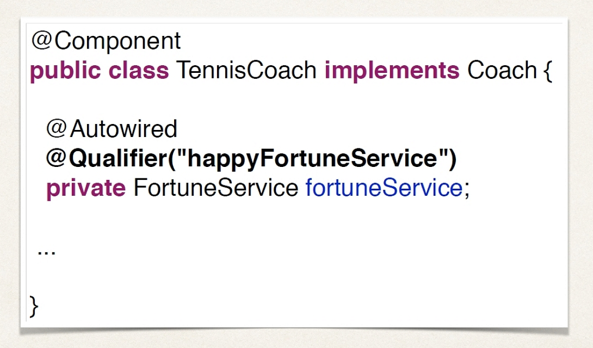

- Bean Scopes with Annotations
    - Singleton Scope Example

    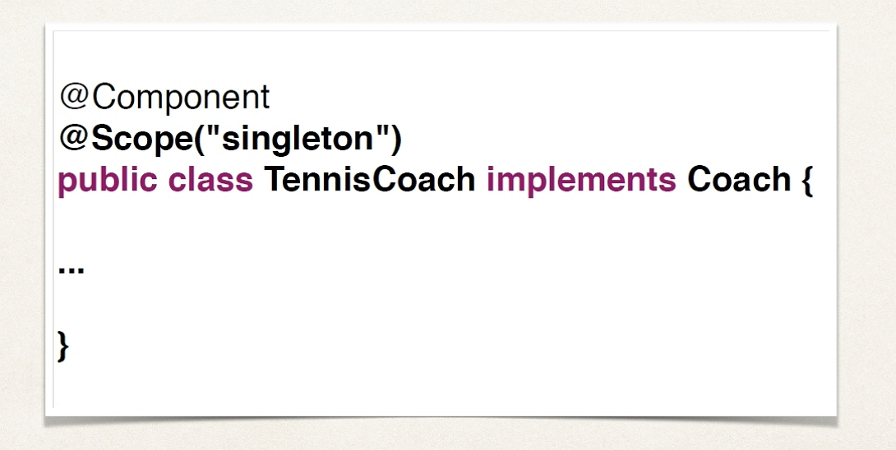

    - Prototype Scope Example

    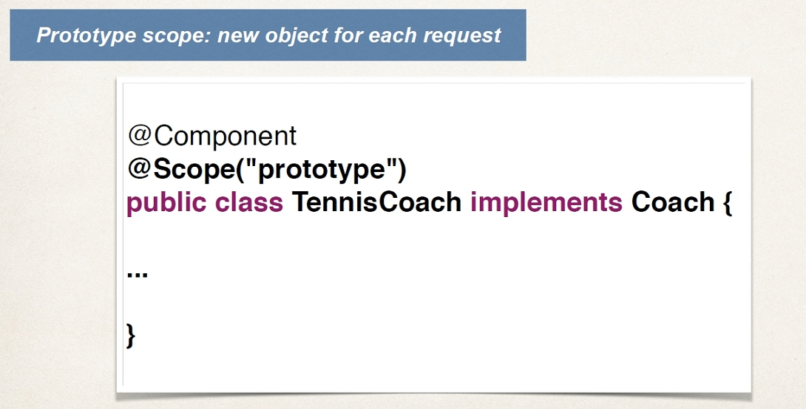

- Bean Lifecycle Methods with Annotations
    - 定義 init 和 destroy 的方法，加入 Annotations @PostConstruct 和 @PreDestroy

    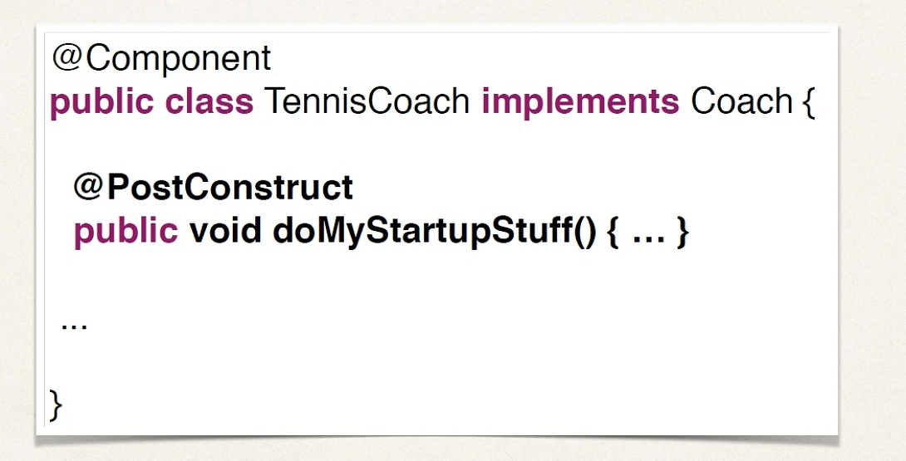

    

### Spring Configuration with Java Code

- 使用 Spring container 取代 XML
- 使用 Java 代碼配置 Spring container
- 配置 Spring container 的3種方式
    1. 完整的 XML 配置

    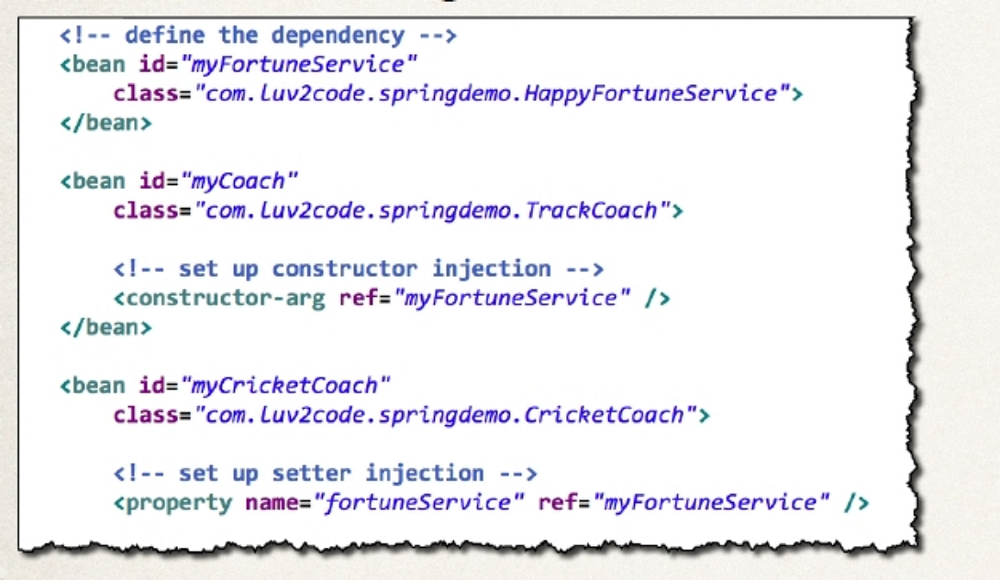

    2. XML Component 掃描

    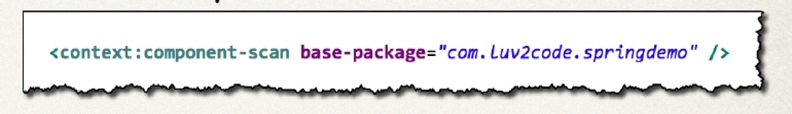

    3. Java 配置 class

    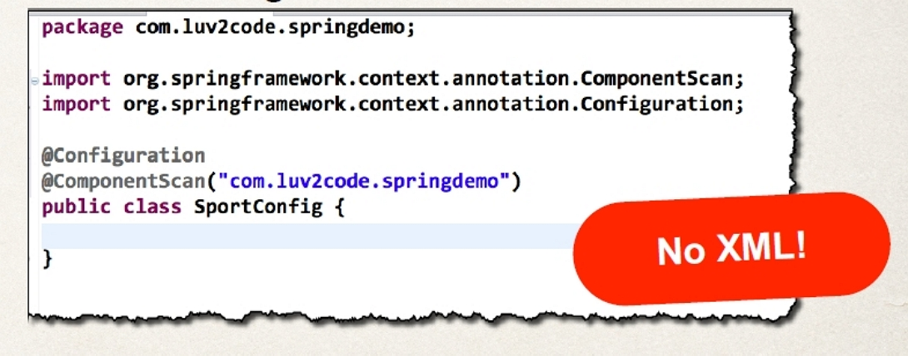

    - 開發步驟
        1. 創建一個Java class 並註解為@Configuration

        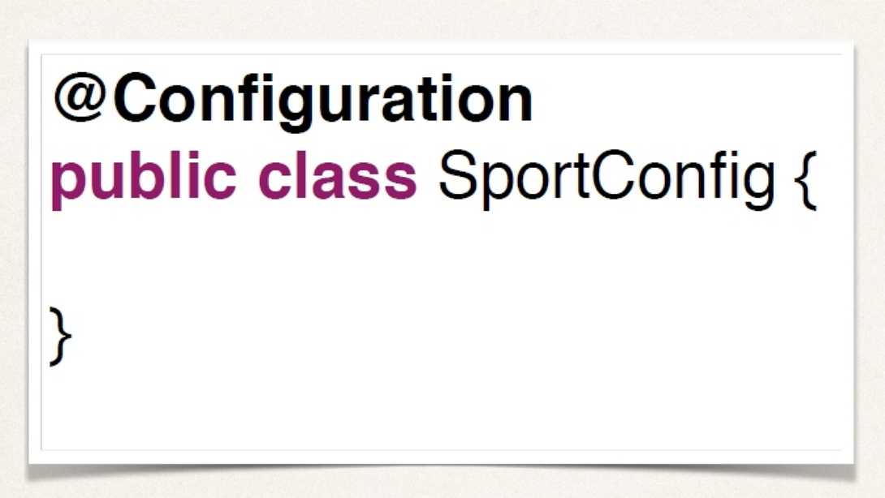

        2. 添加 Component 掃描 @ComponentScan（可選）

        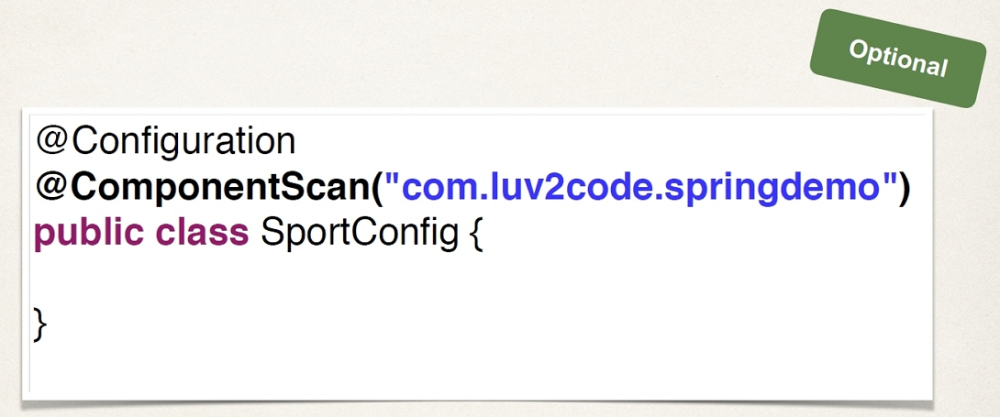

        3. 讀取 Spring Java 配置 class

        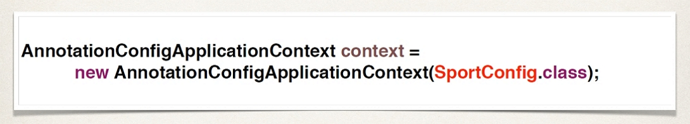

        4. 從 Spring container 中檢索 bean

        

- Defining Beans with Java Code
    - 開發步驟
        1. 定義 bean 的方法

        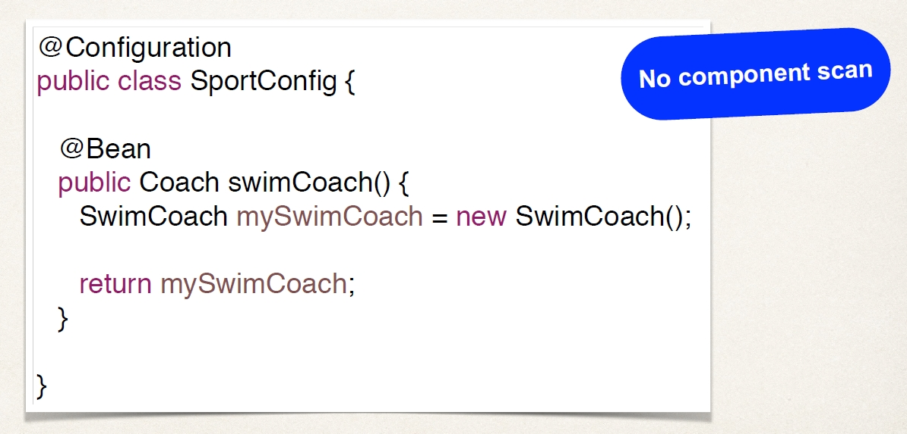

        2. 注入 bean dependencies

        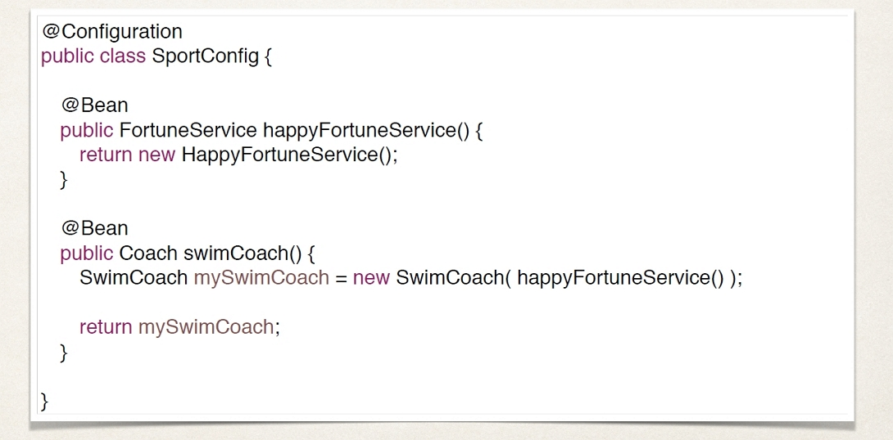

        3. 讀取 Spring Java 配置 class

        

        4. 從 Spring container 中檢索 bean

        

- Injecting Values from Properties File
    - 開發步驟
        1. 創建 Properties File

        

        2. 在 Spring 配置文件中加載 Properties File

        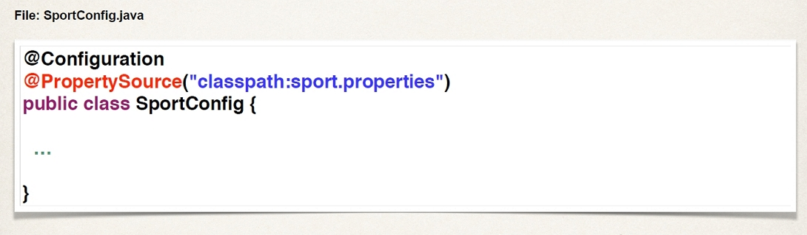

        3. 以 Properties File 值作為依據

        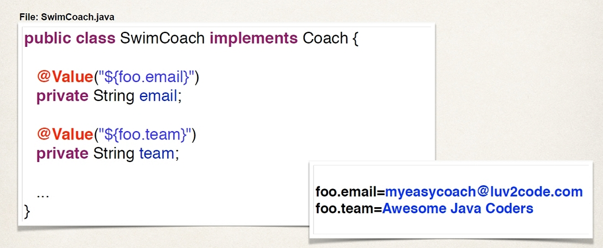

        

    

   

 

