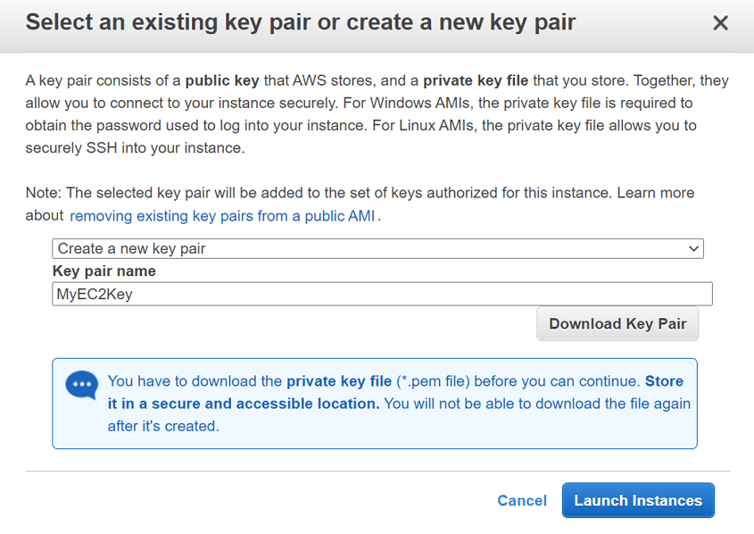

# Introduction to EC2

## Elastic Compute Cloud (EC2)

- 虛擬運算環境，採租用的方式，不須購買
- Amazon 將這些虛擬機器稱為執行個體 (Instance)
- 供執行個體使用的預先設定範本，其中封裝伺服器所需的元件 (包括作業系統和其他軟體)，稱為 Amazon Machine Images (AMI)
- 允許安裝自定義的應用程式及服務
- 可以根據所面臨的需求，輕鬆擴展基礎架構 (即擴展或縮減基礎架構)
- EC2 環境提供執行個體 CPU、記憶體、儲存和聯網功能等多種組態配置
- 沒有儲存空間限制，可以根據正在使用的執行個體來選擇儲存空間
- Instance store 提供臨時儲存磁碟區提供供停止、休眠或終止執行個體所刪除的暫時性資料使用，執行個體終止後，存儲在其中的數據將被刪除
- Amazon Elastic Block Store (Amazon EBS) 提供資料的持久性儲存磁碟區 
- 執行個體可以放置在多個實體位置，這些實體位置稱為可用區域 Availability Zones (AZ)
- 可以將多個執行個體部署在多個 AZ，當執行個體在一個 AZ 失敗，AWS 自動將地址重新映射到另一個 AZ
- 執行個體也可以從一個 AZ 遷移至另一個 AZ
- 要管理執行個體，映像檔和其他 EC2 資源，可以透過中繼資料亦即標籤形式分配給每個資源
- 使用金鑰對來保護執行個體的登入資訊 (AWS 會存放公有金鑰，而管理者則於安全位置存放私有金鑰)
- 防火牆可指定通訊協定、連接埠，以及能夠使用安全群組 (security groups) 設定進入執行個體的來源 IP 範圍
- 可供動態雲端運算使用的靜態 IPv4 地址，亦即彈性 IP 地址 (Elastic IP addresses)
- 可建立虛擬網路，亦即 Virtual Private Cloud (VPC)，這些網路在邏輯上與 AWS 雲端上的其他網路隔離，可選擇將其連接至自己的網路

## 架構圖

**1. EC2 基本架構**


**2. 分配 Elastic IP 與指定 Instance 相關聯**


**3. 透過 Windows RDC 連接 Windows Instance**


## 實作步驟

### EC2 基本操作

**1. 選擇 EC2 服務**


**2. 從左邊選單選擇 Instances，在主要頁面點擊 Launch Instance**


**3. 選擇 AMI**


**4. 選擇 Instance Type**


**5. 設定 Instance Details**

- 點開 Advanced Details，User data 裡填入以下內容(在 Apache 伺服器下創造一個HTML網頁)

```sh
#!/bin/bash

sudo su

yum update -y

yum install httpd -y

systemctl start httpd

systemctl enable httpd

echo "<html><h1> Hi Whizlabs, I am a public page </h1><html>" >> /var/www/html/test.html
```


**6. Add Storage：不需要更動**


**7. Add Tags：Key 欄位填入 Name，Value 欄位填入 MyEC2Server**


**8. 設定 Security Group**

- 選擇 Create a new security group
- Security group name：MyEC2ServerGroup
- Description：My EC2 Security Group
- 添加 SSH、HTTP 以及 HTTPS 規則


**9. Key Pair：創建一個新的名稱叫 MyEC2Key的 Key Pair 並下載下來**



**10. Launch Status：執行個體會進行啟動，並等待執行個體完全初始化，直到狀態更改為`執行中(running)`**


**11. 記下EC2 執行個體的 IPv4 public IP，以便能夠 SSH 進入主機進行維運**


**12. 在瀏覽器中輸入 public IP 後面輸入文件名，可以看到 HTML 內容**


### Elastic IP 與 Instance 相關聯

**1. 在左方 EC2 選單欄位，找到`Network & Security`下方點擊`Elastic IPs`，接著再點擊`Allocate Elastic IP Address`**


**2. 直接點擊`Allocate`，不須更改任何選項**


**3. 可以看到 Elastic IP 已成功分配**


**4. 選擇已創建 Elastic IP，然後點擊`Actions`，再點擊`Associate Elastic IP address`**


**5. 進到 Associate Elastic IP address 頁面**

- Resource Type：選擇 Instance
- 在下拉選單選擇要關聯的 Instance
- 其他欄位保留預設值


**6. 完成之後即可看到 Elastic IP 與 Instance 相關聯**


**7. 轉到 Instance 頁面查看 public IP，它應該與 Elastic IP 相同**


**8. 將通過輸入 Elastic IP 而不是先前的 public IP 來檢查網頁**


### 透過 Windows RDC 連接 Windows Instance

**- Instance 要使用 windows AMI**

**1. 選擇 EC2 Instance，點擊`Connect`**


**2. 再點擊`RDP Client`頁籤，然後點擊`Download remote desktop file`，下載遠端桌面連線檔並在對話視窗點擊`Get password`來取得遠端登入密碼**


**3. 點擊`Get password`，會需要你上傳 Key Pair**


**4. 用戶名稱和密碼將顯示在對話框中，確保將它們記錄在某個地方，以備將來使用**


**5. 點擊之前下載的 remote desktop file，並點擊來進行遠端桌面連線，並輸入使用者名稱密碼來進行遠端桌面連接**


