# Spot Instance

## EC2 Spot Instance (競價型執行個體)

- Spot Instance 是未使用的 EC2 執行個體，其使用價格低於隨需定價，最高可享受 90% 的折扣，但是，如果當前價格高於指定的最高價格，則 AWS 可以中斷該競價型執行個體
- 競價與隨需以及預留執行個體使用相同的 EC2 AMI 和執行個體類型，如能彈性決定應用程式執行的時機以及應用程式是否可以中斷，則 Spot Instance 會是一項具成本效益的選擇
- 可以將 Spot Instance 用於各種無狀態、容錯或彈性應用程式
- Spot Instances 與啟動 EC2 方式相同，像是使用 Spot Fleets，Auto Scaling 群組以及 AWS 控制台
- 如果在一個小時內終止或停止 Spot Instance，則不會向您收費
- 但是，如果選擇自己停止或終止新啟動的 Spot Instance，則必須支付使用的總秒數

## 架構圖

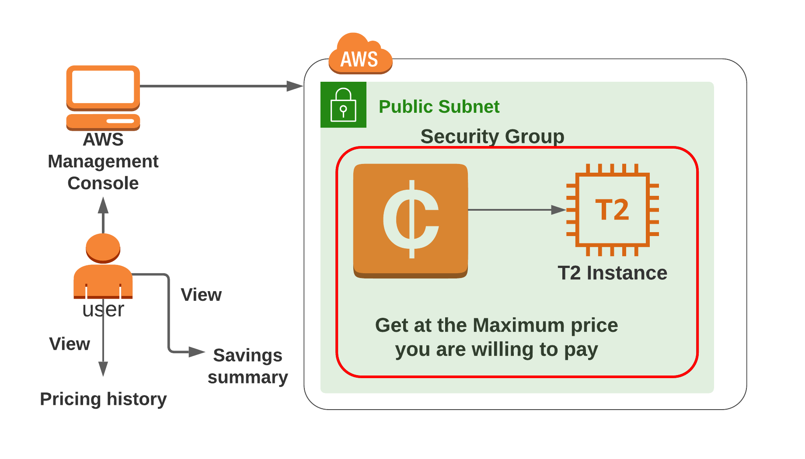

## 實作步驟

1. 選擇 EC2 服務
2. 關閉選單左上方的 `New EC2 experience`

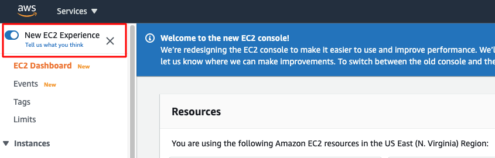

出現 `feedback for EC2`，點擊 `Cancel`

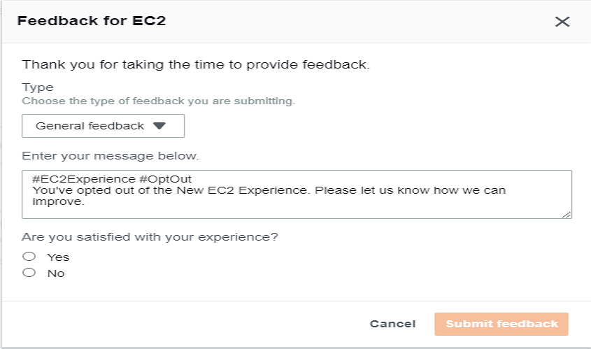

3. 從左邊選單找到 `Instances`，在主要頁面點擊 `Launch Instance`

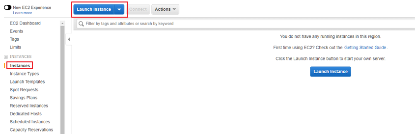

4. 選擇 AMI

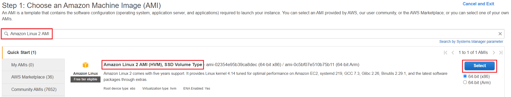

5. 選擇 Instance Type

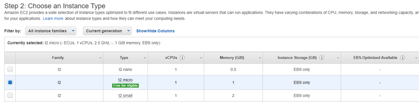

6. 設定 Instance Details

- Number of instances: 1
- Purchasing option：Request Spot instances 打勾，就會看到現在各 Availability Zone 現在的價格
- Persistent request：不用選擇
- Auto-assign Public IP：選擇 Enable

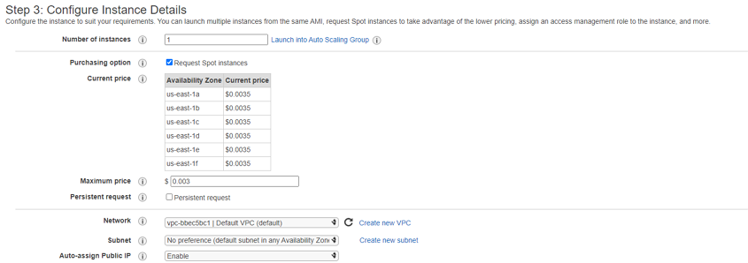

- 點開 Advanced Details，User data 裡填入以下內容(在 Apache 伺服器下創造一個HTML網頁)

```sh
#!/bin/bash

sudo su

yum update -y

yum install httpd -y

systemctl start httpd

systemctl enable httpd

echo "<html><h1> Welcome to Whizlabs Server</h1><html>" >> /var/www/html/index.html
```

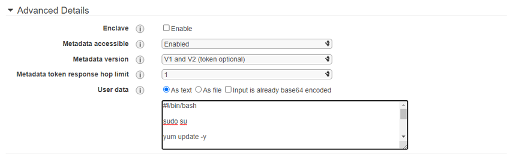

7. Add Storage：不需要更動
8. Add Tags：Key 欄位填入 Name，Value 欄位填入 MySpotInstance
9. Configure Security Group

- 選擇 Create a new security group
- Security group name：MyEC2SecurityGroup
- Description：My EC2 Security Group
- 添加 SSH 以及 HTTP 規則

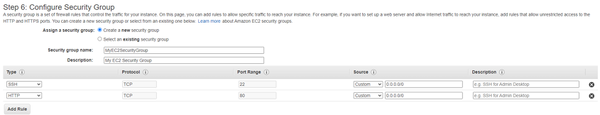

10. Key Pair：創建一個新的名稱叫 MySpotKey 的 Key Pair 並下載下來
11. 啟動過程會出現失敗畫面，這是由於填入的 Maximum price 低於定價

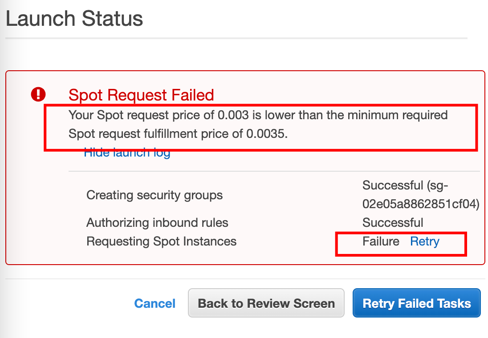

12. 回到 Configure Instance Details 修改 Maximum price，再重新啟動即可

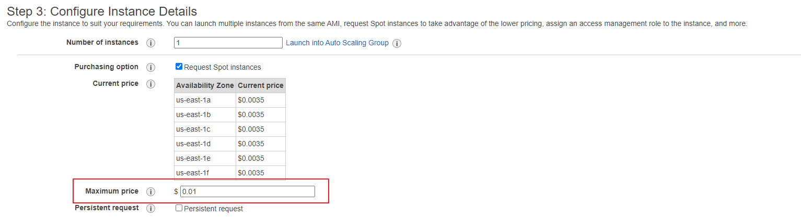

13. 查看執行個體狀態

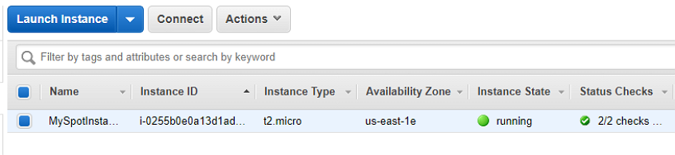

14. 測試網頁是否正常啟動

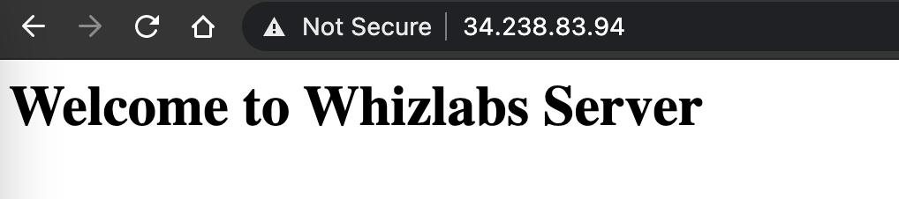

15. 檢視 Spot Request

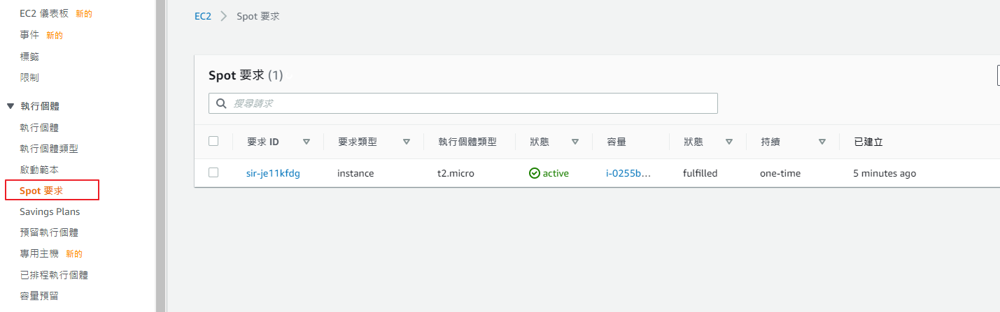

16. 點擊 Request ID，即可看到更多 spot request 的細節

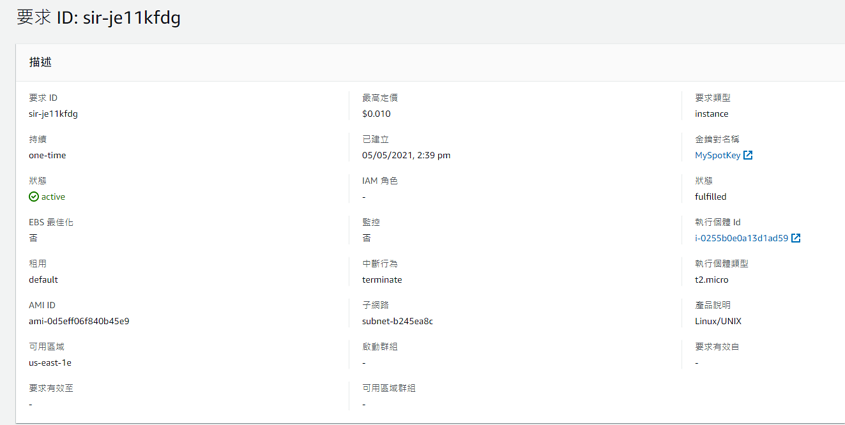

17. 在右上角，點擊可查看 Saving summary 以及 Pricing history

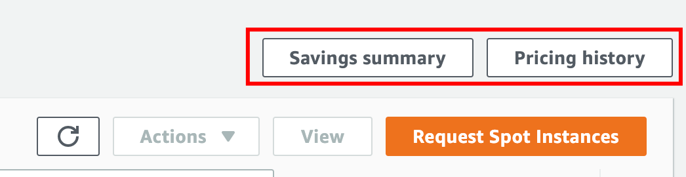

18. 查看 Saving summary

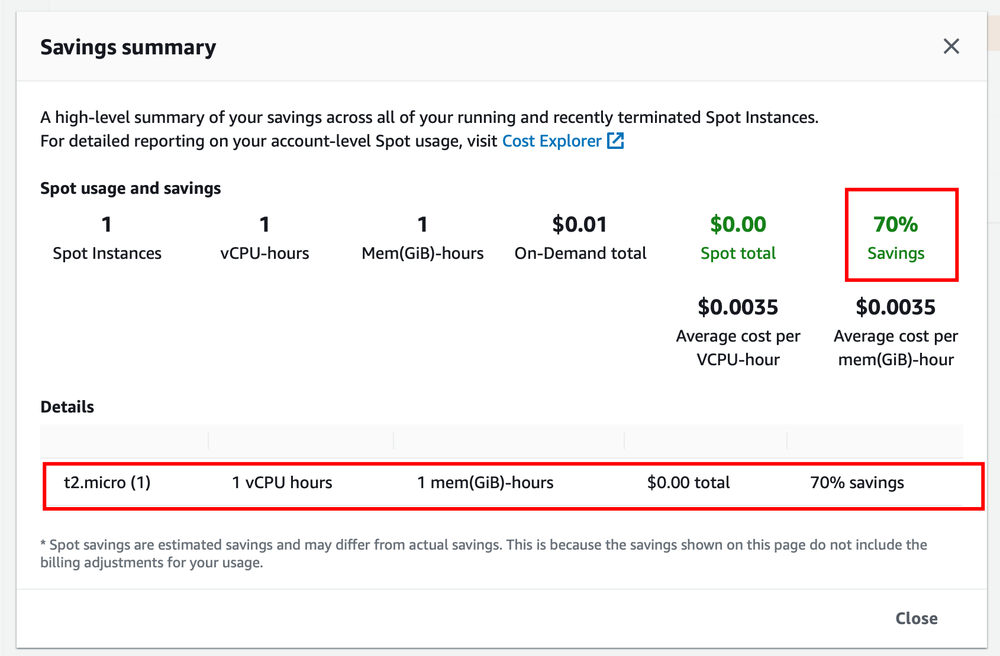

19. 查看 Pricing history，可以透過選單設定想要查看的細節

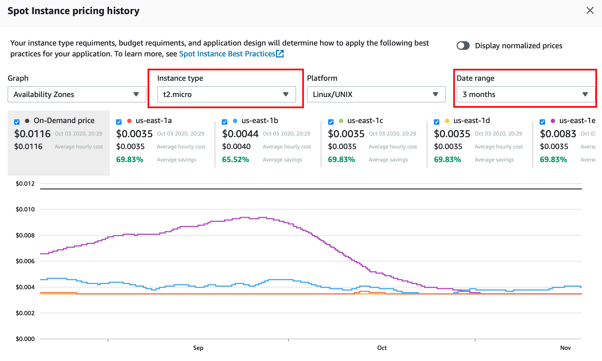

20. 刪除並取消 Spot Instance

- 在左方 Spot Requests 並選擇要終止的 request

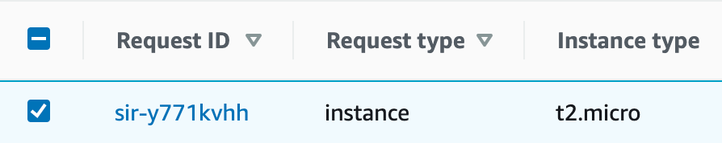

- 在右上方會看到 `Actions`，點擊 `Cancel request`

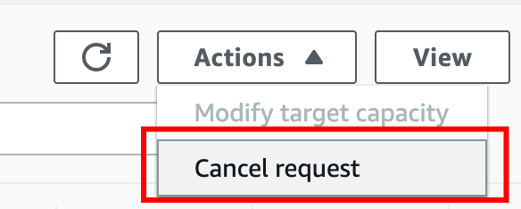


