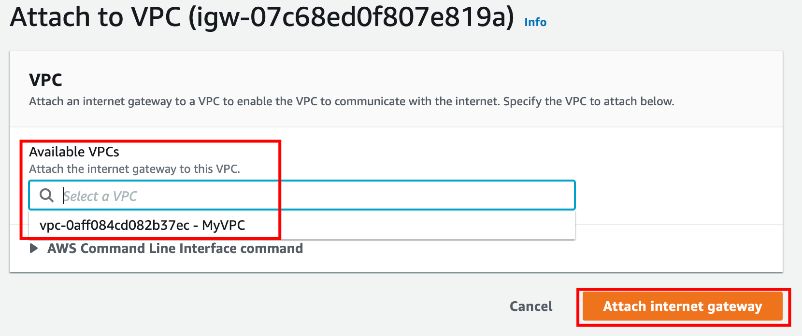

# VPC Basic

## 應用場景
在傳統業務需求當中，會為資訊產品建立一個獨立網路環境規劃，因此就需要 VPC，VPC 與 VPC 之間會互相隔離，避免之間直接存取資料。VPC 可以在所有可用區域內建立，並新增一個或多個子網路。

## 核心名詞

- Internet Gateway (網際網路閘道)：是一種水平擴展、備援且高可用性的 VPC 元件，允許 VPC 與網際網路之間的通訊。Internet Gateway 有兩種用途：在 VPC 路由表中提供可由網際網路路由之流量的目標，以及針對已獲指派公有 IPv4 地址的執行個體執行網路位址轉譯 (NAT)。

- 路由表 (Route table) ：一組名為路由的規則，用來判斷網路流量的方向
  - 主路由表 (Main route table)：自動隨附於 VPC 的路由表。它會控制所有並未與任何其他路由表明確建立關聯之子網路的路由。
  - 自訂路由表 (Custom route table)：自己為 VPC 建立的路由表。
  - 路由表關聯 (Route table association)：路由表與子網路、網際網路閘道或虛擬私有閘道之間的關聯。
  - 子網路路由表 (Subnet route table)：與子網路相關聯的路由表。
  - 閘道路由表 (Gateway route table)：與網際網路閘道或虛擬私有閘道相關聯的路由表。
  - 本機閘道路由表 (Local gateway route table)：與 Outposts 本機閘道相關聯的路由表。
  - 目的地 (Destination)：想要流量傳送的 IP 位址範圍 (目的地 CIDR)。
  - 目標 (Target)：要透過其傳送目的地流量的閘道、網路介面或連線；例如，網際網路閘道。
  - 本機路由 (Local route)：VPC 內用於通訊的預設路由。

- 子網路 (Subnet)： 建立 VPC 之後，可以在各個可用區域 (Availability Zone) 新增一或多個子網路。在業界實務中，會按照產品需求切割網段，並將 Instance 分別擺在不同網段。一個 subnet 只能存在一個 Availability Zone。

- NAT Gateway (網路位址轉譯閘道)：讓私有子網路中的執行個體連線至網際網路或其他 AWS 服務，但防止網際網路啟動與這些執行個體的連線。若要建立 NAT 閘道，必須指定 NAT 閘道所在的公有子網路 (Pubilc Subnet)。

- VPC 端點 (VPC endpoint)：將 VPC 私下連線至支援的 AWS 服務以及具有 AWS PrivateLink 功能的 VPC 端點服務，而不需要網際網路閘道、NAT 裝置、VPN 連接或 AWS Direct Connect 連線

- Peering Connection：有些時候，資料對接時希望不要透過外部網路溝通，此時透過 Peering Connection 可以讓兩個 VPC 之間進行內部網路溝通
  - **注意**：必須確保VPC內沒有重疊的 IPv4 CIDR， 否則 VPC 相互連線會形成 failed

- VPN Connection：以私有 IP 的方式串連本地網路與雲端網路環境

- Flow Logs：可以擷取傳入及傳出 VPC 中網路介面之 IP 流量相關資訊，並可發布至  Amazon CloudWatch Logs 與 S3。

## 架構

#### 生活場景

#### 經典雲端網路環境架構

## VPC 四大類對接方式

1. 私有網段連接外網：NAT Gateway

2. VPC 以內網方式操作 AWS 服務：VPC Endpoint
    - AWS 的服務，預設情況下，與 VPC 內的 Instance 進行連線，會從外部網路進行存取，因此若要以內網方式進行連線，便以 VPC Endpoint 讓 VPC 內 Instance 可以內網的方式與 AWS 服務進行串接

3. VPC 串接 VPC：Peering Connection
    - 當有多個獨立產品分別採用獨立的 VPC，當需要進行資料共享時，在預設情況下，兩個 VPC 必須透過外部網路相互連線，為了讓兩個 VPC 可以內網方式進行串接，可透過 Peering Connection 讓兩者之間以私有 IP 進行連線

4. VPC 串接本地網路：VPN Connection
    - 當公司本地端網路環境要與 VPC 進行串接，預設情況下，必須以外網進行串接，透過 VPN Connection 即可透過內網且加密的方式進行串接

## VPC Classic LAB

 **創建VPC步驟**

1. 通過 AWS 管理控制台找到 VPC

2. 從左側邊攔中單擊 `Your VPCs`

3. 點擊 `Create VPC`

    - Name tag：輸入一個 VPC 名稱以標識您的 VPC。例如：MyVPC
    - IPv4 CIDR block：輸入 10.0.0.0/16
    - Tenancy：不需要更改，確認 Default 已選擇
    - 然後點擊 `Create VPC`

4. 創建 VPC 後，將顯示詳細信息，如下所示

**創建 Subnet 步驟**

1. 創建 Public Subnet
    - 單擊左側菜單中的 `Subnets`

    - 再點擊 `Create subnet`

    - VPC：從先前創建的列表中選擇 MyVPC
    - Availability Zone : 選擇 us-east-1a
    - IPv4 CIDR block : 輸入 10.0.1.0/24

2. 創建 Private Subnet
    - VPC：從先前創建的列表中選擇 MyVPC
    - Availability Zone : 選擇 us-east-1b
    - IPv4 CIDR block : 輸入 10.0.2.0/24

3. 創建和配置 Internet Gateway
    - 從左側邊攔中單擊 `Internet Gateway`

    - 創建 `Internet Gateway`
    - Name Tag : 輸入 MyInternetGateway

    - 從列表中選擇您創建的 Internet Gateway
    - 點擊 `Actions`
    - 再點擊 `Click on Attach to VPC`

    - 從列表中選擇創建的 MyVPC，然後點擊 `Attach internet gateway`

**創建 Route Tables**

1. 創建 PublicRouteTable
    - Name Tag：輸入 PublicRouteTable
    - VPC：從清單中選擇 MyVPC 

    - 點選 PublicRouteTable 並選擇 `Subnet Associations`  
    - 點擊 `Edit subnet associations`

    - 從清單中選擇 **MyPublicSubnet** 

2. 創建 PrivateRouteTable
    - Name Tag：輸入 PrivateRouteTable
    - VPC：從清單中選擇 MyVPC
    - 點選 PrivateRouteTable 並選擇 Subnet Associations
    - 點擊 `Edit subnet associations`
    - 從清單中選擇 **MyPrivateSubnet**

3. PublicRouteTable：添加路由以允許 Internet 流量到達 VPC
    - 選取路由頁簽，單擊 `Edit Route`
    - 點擊 `Add Route`
    - Destination：0.0.0.0/0
    - Target：從下拉菜單中選擇 Internet Gateway 選擇 MyInternetGateway
