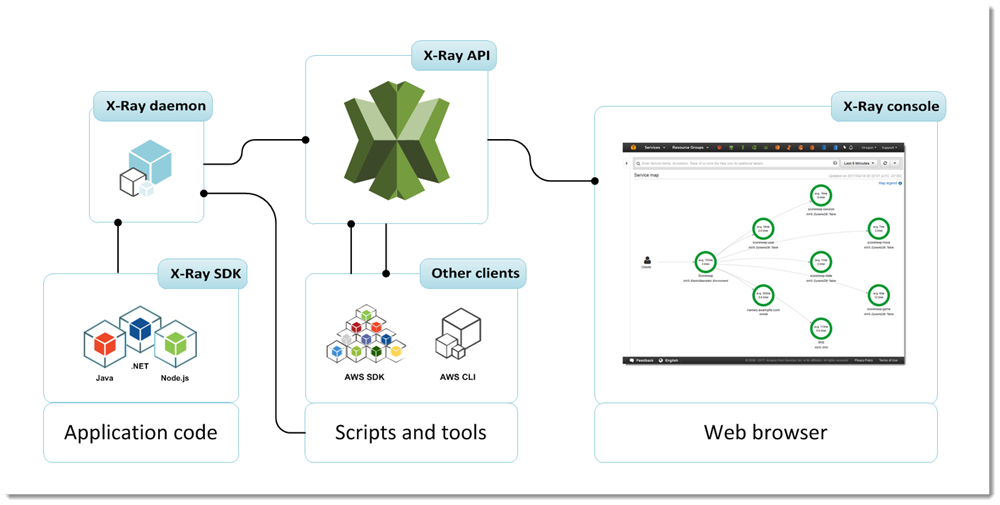

# AWS X-RAY

## 什麼是 AWS X-Ray？

AWS X-Ray 是一項服務，可協助開發人員分析和偵錯生產、分散式應用程式，收集您應用程序所服務的請求的相關數據，並提供用於查看，篩选和獲取數據洞察力的工具，從而解決問題和發現優化的機會，對於任何被追蹤應用程式的請求，既可以查看請求和響應的詳細訊息，又可以查看應用程式對下游 AWS 資源，微服務，數據庫和 HTTP Web API 進行調用的詳細訊息
X-Ray開發工具包提供：

- 攔截器：可添加到您的代碼中以追蹤傳入 HTTP 請求

- 客戶端處理程序：可分析你的應用程序用來調用其他 AWS 服務的 AWS 開發工具包客戶端

- HTTP 客戶端：用於分析對其他內部和外部 HTTP Web 服務的調用

開發工具包還支持分析對 SQL 資料庫的調用、自動 AWS 開發工具包客戶端分析以及其他功能

## 應用場景

建立並執行**分散式應用程式**，必須倚賴以每個服務或每個資源為基礎的程序，才能在請求通過應用程式的各個組成元件時追蹤該應用程式請求。由於應用程式執行或使用的架構、服務和資源有各種日誌格式及儲存媒體，使得這個問題變得更為複雜。這樣一來，從最終使用者或服務發出請求到應用程式傳回回應的整個過程，就很難建立各個資料之間的關聯及建立這個過程的完整描述。
X-Ray 提供一個**以使用者為中心**，而非以服務或資源為中心的模型，用以收集對應用程式提出請求的相關資訊。這個模型可讓您在請求通過各個服務和資源時，建立一個以使用者為中心的完整描述。X-Ray 透過代理聯繫和彙整資料，讓開發人員專心改進應用程式最終使用者的體驗。

## X-Ray 作用

- 建立服務地圖：X-Ray 透過追蹤對應用程式發出的請求，建立一個應用程式使用的服務地圖。將可以提供一個應用程式內各種服務之間聯繫的視圖，也能讓開發人員建立一個相依關係樹狀結構、在 AWS 可用區域或區域之間工作時偵測延遲或錯誤，以及將注意力集中在未如預期般運作的服務等
- 識別問題和錯誤：X-Ray 會分析對應用程式發出之每個請求的回應代碼，自動醒目提示應用程式程式碼中的錯誤或問題。這樣可輕鬆偵錯應用程式程式碼，且不需要重現錯誤或問題
- 建立自己的分析和視覺化應用程式：X-Ray 提供一組查詢 API，可供您建立使用 X-Ray 記錄資料的分析和視覺化應用程式

## 核心名詞

- 追蹤(trace)：X-Ray 追蹤是一組共享同個追蹤 ID 的資料點。例如，用戶端對應用程式提出請求時，就會對它指派一個唯一的追蹤 ID。當請求進入到應用程式的服務時，服務會使用這個唯一的追蹤 ID，將與請求有關的資訊轉送回 X-Ray。應用程式中每個服務轉送到 X-Ray 的資訊就是一個片段，而追蹤就是片段的集合

- 片段(segment)：X-Ray 片段會封裝分散式應用程式中單一元件 (例如：授權服務 authorization service) 的所有資料點。片段包含註解形式的系統定義和使用者定義的資料，且由一或多個子片段組成，這些子片段代表從服務發出的遠端呼叫。例如，應用程式對資料庫發出呼叫以回應請求時，它會為該請求建立一個片段，其中包含代表資料庫呼叫及其結果的子片段。子片段可包含查詢、使用的表格、時間戳記和錯誤狀態這類資料

- 註解(annotation)：X-Ray 註解是與片段關聯的系統定義或使用者定義的資料。一個片段可包含多個註解。系統定義的註解包含由 AWS 服務新增到片段的資料，而使用者定義的註解則是由開發人員新增到片段的中繼資料。例如，會自動在應用程式建立的片段中導入 AWS 服務呼叫的區域資料，而您可以選擇對非 AWS 服務發出的呼叫自己新增區域資料

- 錯誤(error)：X-Ray 錯誤是與造成錯誤回應之呼叫片段關聯的系統註解。錯誤中包含錯誤訊息、堆疊追蹤，以及將錯誤與來源檔關聯的任何其他資訊 例如：版本或遞交 ID (commit ID)

- 抽樣(sampling)：為了提供高效且經濟實惠的使用體驗，X-Ray 不會收集傳送到應用程式的每個請求的資料。而是針對具有統計意義的請求數量收集資料。因此，X-Ray 不應做為稽核或合規工具，因為它無法保證資料的完整性

- X-Ray 代理器(X-Ray agent)：X-Ray 代理器從日誌檔收集資料，然後將它們傳送到 X-Ray 服務進行彙整、分析和儲存。代理器讓您輕鬆將資料傳送到 X-Ray 服務而不是直接使用 API，而且這個代理器可在 Amazon Linux AMI、Red Hat Enterprise Linux (RHEL) 及 Windows Server 2012 R2 或更新版本的作業系統中使用
