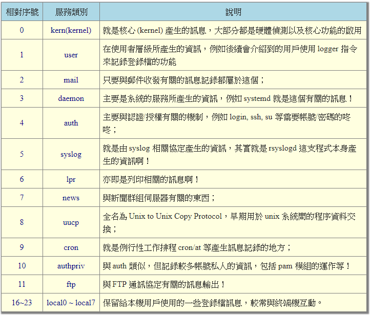
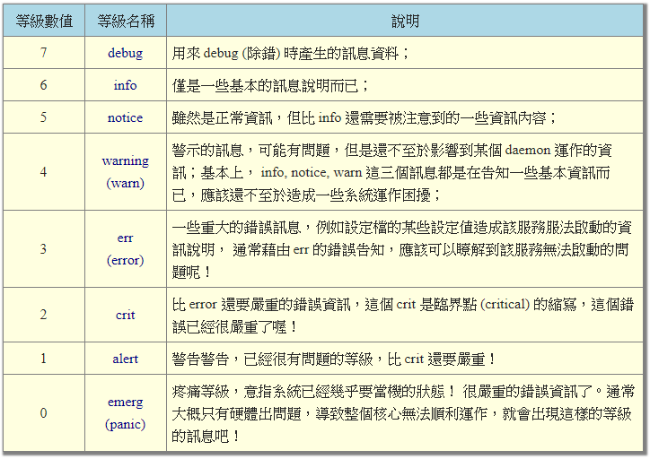

# rsyslog 介紹與使用

## 介紹

在 Cent OS 中，日誌是使用 rsyslogd 進行管理的，是之前版本的系統中 syslogd 的升級版，對原有的日誌系統進行了功能的擴展，提供了諸如過濾器，日誌加密保護，各種配置選項，輸入輸出模塊，支持通過 TCP 或者 UDP 協議進行傳輸等

## 配置

Rsyslog 的主要配置文件為 `/etc/rsyslog.conf` 文件，這個檔案規定了
1. 什麼服務
    - Linux 核心的 syslog 認識的服務類型主要有底下這些
    

2. 什麼等級訊息
    - Linux 核心的 syslog 將訊息分為七個主要的等級，根據 syslog.h 的定義，訊息名稱與數值的對應如下：
    
    
    - **註：在訊息等級之前還有 .[=!] 的連結符號，代表的意思如下：**
        - `.`：代表『比後面還要嚴重的等級 (含該等級) 都被記錄下來』的意思，例如： mail.info 代表只要是 mail 的資訊，而且該資訊等級嚴重於 info (含 info 本身)時，就會被記錄下來的意思
        - `.=`：代表所需要的等級就是後面接的等級而已， 其他的不要
        - `.!`：代表忽略大於等於這個等級的訊息，亦即低於這個等級的才會被紀錄的意思

3. 需要被記錄在哪裡(裝置或檔案)，底下就是一些常見的放置處：
    - 檔案的絕對路徑：通常就是放在 `/var/log` 裡頭的檔案
    - 印表機或其他：例如 `/dev/lp0` 這個印表機裝置
    - 使用者名稱：顯示給使用者
    - 遠端主機：例如 @study.vbird.tsai
    - `*`：代表『目前在線上的所有人』
    設定的語法如下：
```sh
# 底下以 mail 這個服務產生的 info 等級為例：
mail.info			/var/log/maillog_info
# 這一行說明：mail 服務產生的大於等於 info 等級的訊息，都記錄到 
# /var/log/maillog_info 檔案中的意思。
```

## rsyslog.conf檔案詳解

```sh
# rsyslog configuration file

#### MODULES ####
#載入模組列表

# The imjournal module bellow is now used as a message source instead of imuxsock.
$ModLoad imuxsock # provides support for local system logging (e.g. via logger command)
提供對本地系統日誌的支援
$ModLoad imjournal # provides access to the systemd journal
提供對systemd日誌的訪問
#$ModLoad imklog # reads kernel messages (the same are read from journald)
讀取核心訊息
#$ModLoad immark  # provides --MARK-- message capability
提供--MARK--訊息功能

# Provides UDP syslog reception
#$ModLoad imudp
#$UDPServerRun 514  允許514埠接收使用UDP協議轉發過來的日誌

# Provides TCP syslog reception
#$ModLoad imtcp
#$InputTCPServerRun 514允許514埠接收使用TCP協議轉發過來的日誌
```

```sh
#### GLOBAL DIRECTIVES ####
#全域性指令，
# Where to place auxiliary files
$WorkDirectory /var/lib/rsyslog

# Use default timestamp format  定義日誌格式預設模板 
$ActionFileDefaultTemplate RSYSLOG_TraditionalFileFormat

# File syncing capability is disabled by default. This feature is usually not required,
# not useful and an extreme performance hit
#$ActionFileEnableSync on

# Include all config files in /etc/rsyslog.d/
$IncludeConfig /etc/rsyslog.d/*.conf

# Turn off message reception via local log socket;
# local messages are retrieved through imjournal now.
$OmitLocalLogging on

# File to store the position in the journal
$IMJournalStateFile imjournal.state
```

```sh
#### RULES ####
#規則
# Log all kernel messages to the console.
# Logging much else clutters up the screen.
#kern.*                                                 /dev/console
關於核心的所有日誌都放到/dev/console(控制檯)

# Log anything (except mail) of level info or higher.
# Don't log private authentication messages!
*.info;mail.none;authpriv.none;cron.none                /var/log/messages
記錄所有日誌型別的info級別以及大於info級別的資訊到/var/log/messages，但是mail郵件資訊，authpriv驗證方面的資訊和cron時間任務相關的資訊除外

# The authpriv file has restricted access.
authpriv.*                                              /var/log/secure
authpriv驗證相關的所有資訊存放在/var/log/secure

# Log all the mail messages in one place.
mail.*                                                  -/var/log/maillog
郵件的所有資訊存放在/var/log/maillog; 這裡有一個-符號, 表示是使用非同步的方式記錄, 因為日誌一般會比較大

# Log cron stuff
cron.*                                                  /var/log/cron
計劃任務有關的資訊存放在/var/log/cron

# Everybody gets emergency messages
*.emerg                                                 :omusrmsg:*
 記錄所有的大於等於emerg級別資訊, 以wall方式傳送給每個登入到系統的人

# Save news errors of level crit and higher in a special file.
uucp,news.crit                                          /var/log/spooler
記錄uucp,news.crit等存放在/var/log/spooler
uucp  –unix to unix copy, unix主機之間相關的通訊，news   –新聞組

# Save boot messages also to boot.log
local7.*                                                /var/log/boot.log
啟動的相關資訊
```

- `#kern.*`：只要是核心產生的訊息，全部都送到 console(終端機) 去。console 通常是由外部裝置連接到系統而來， 舉例來說，很多封閉型主機 (沒有鍵盤、螢幕的系統) 可以透過連接 RS232 連接口將訊息傳輸到外部的系統中， 例如以筆記型電腦連接到封閉主機的 RS232 插口。這個項目通常應該是用在系統出現嚴重問題而無法使用預設的螢幕觀察系統時， 可以透過這個項目來連接取得核心的訊息

- `.info;mail.none;authpriv.none;cron.none`：由於 mail, authpriv, cron 等類別產生的訊息較多， 且已經寫入底下的數個檔案中，因此在 /var/log/messages 裡面就不記錄這些項目。除此之外的其他訊息都寫入 /var/log/messages 中。這也是 messages 檔案很重要的緣故！

- `authpriv.*`：認證方面的訊息均寫入 `/var/log/secure` 檔案

- `authpriv.*`：認證方面的訊息均寫入 `/var/log/secure` 檔案

- `cron.*`：例行性工作排程均寫入 `/var/log/cron` 檔案

- `.emerg`：當產生最嚴重的錯誤等級時，將該等級的訊息以 wall 的方式廣播給所有在系統登入的帳號得知， 目的是讓使用者能夠趕緊通知系統管理員來處理嚴重的錯誤問題

- `uucp,news.crit`：uucp 是早期 Unix-like 系統進行資料傳遞的通訊協定，後來常用在新聞群組的用途中。 news 則是新聞群組。當新聞群組方面的資訊有嚴重錯誤時就寫入 `/var/log/spooler` 檔案中

- `local7.*`：將本機開機時應該顯示到螢幕的訊息寫入到 `/var/log/boot.log` 檔案中

```sh
#### begin forwarding rule ###
 轉發規則
# The statement between the begin ... end define a SINGLE forwarding
# rule. They belong together, do NOT split them. If you create multiple
# forwarding rules, duplicate the whole block!  
# Remote Logging (we use TCP for reliable delivery)
# An on-disk queue is created for this action. If the remote host is
# down, messages are spooled to disk and sent when it is up again.
#$ActionQueueFileName fwdRule1 # unique name prefix for spool files
#$ActionQueueMaxDiskSpace 1g   # 1gb space limit (use as much as possible)
#$ActionQueueSaveOnShutdown on # save messages to disk on shutdown
#$ActionQueueType LinkedList   # run asynchronously
#$ActionResumeRetryCount -1    # infinite retries if host is down
# remote host is: name/ip:port, e.g. 192.168.0.1:514, port optional
#*.* @@remote-host:514  
@@表示通過tcp協議傳送，使用TCP協議轉發到remote-host的514(預設)埠
@表示通過udp進行轉發
# ### end of the forwarding rule ###
```