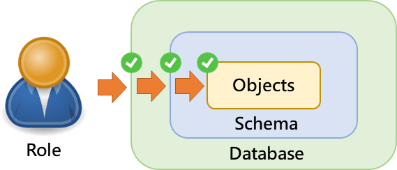

# 資料庫角色、使用者權限管理

PostgreSQL 可以直接針對資料庫的使用者設定權限，也可以先對不同的應用設定好不同的規則（roles），再將不同的規則套用至需要授權的使用者，這樣的方式可以讓管理上夠有彈性，但是可能也會讓管理的操作更為複雜

## PostgreSQL 資料庫授權層級

在 PostgreSQL 中的權限有分為 database、schema 與 object 三個層級，想要授權使用者存取一張資料表（table），就要同時確認該使用者也擁有該資料表所在 database 以及 schema 的存取權限，如果中間缺少了任何一層的權限，就會無法存取



## 建立資料庫的使用者

可以使用 `CREATE USER` 或 `CREATE ROLE` 指令：

```sql
-- CREATE USER 指令
CREATE USER username
WITH PASSWORD 'password';

-- CREATE ROLE 指令
CREATE ROLE username
WITH LOGIN PASSWORD 'password';
```

## public Schema 與 public 角色

- 當一個全新的 PostgreSQL 資料庫被建立時，預設會自動建立一個名稱為 public 的 schema，並將存取權限授予 public 這一個角色，新建立的使用者預設只會繼承 public 角色中所開放的權限，其餘權限都沒有開放

- 當需要建立一個唯讀的使用者帳號（只能讀取、不可寫入資料）時，就必須將 public 角色中的可在 public schema 建立物件的權限拿掉

```sql
REVOKE CREATE ON SCHEMA public FROM PUBLIC;

-- 將 public 角色連線至指定資料庫的權限撤除
REVOKE ALL ON DATABASE databasename FROM PUBLIC;
```

經過這樣的設定之後，需要連線至資料庫的使用者都需要明確以指令進行授權，否則都不可以連線至資料庫

## 建立資料庫角色

為了給使用者分配權限，使用 `GRANT` 指令
語法：

```sql
GRANT privilege [, ...]
ON object [, ...]
TO { PUBLIC | GROUP group | username }
```

privilege 可能的值有：SELECT, INSERT, UPDATE, USAGE, DELETE, RULE, ALL 
object 可能的物件是：表、視圖、序列
PUBLIC：代表所有使用者
GROUP group：代表群組
username：授予權限的使用者名稱

- 設定唯讀角色

```sql
-- 授予角色可連線至資料庫的權限
GRANT CONNECT ON DATABASE databasename TO username;
--授予角色可使用 schema 的權限
GRANT USAGE ON SCHEMA schemaname TO username;
--授予角色可對 schema 的所有資料表進行 SELECT 操作
GRANT SELECT ON ALL TABLES IN SCHEMA schemaname TO username;
-- 授予角色可對單一資料表進行 SELECT 操作
GRANT SELECT ON TABLE tablename TO username;
-- 設定角色對 schema 新資料表的預設權限
ALTER DEFAULT PRIVILEGES IN SCHEMA schemaname
GRANT SELECT ON TABLES TO username;
```

- 設定讀寫角色

```sql
-- 授予角色可在 schema 中使用或建立物件
GRANT USAGE, CREATE ON SCHEMA schemaname TO username;
-- 授予角色可對 schema 的特定資料表進行各種操作
GRANT ALL PRIVILEGES ON TABLE tablename TO username;
-- 設定角色對 schema 新資料表的預設權限
ALTER DEFAULT PRIVILEGES IN SCHEMA schemaname
GRANT ALL PRIVILEGES ON TABLES TO username;
```

對於讀寫角色而言，通常都會需要對 sequences 的使用進行授權

```sql
-- 授予角色可以使用指定的 Sequence
GRANT USAGE ON SEQUENCE Sequencename TO username;
-- 授予角色可以使用所有的 Sequences
GRANT USAGE ON ALL SEQUENCES IN SCHEMA schemaname TO username;
-- 設定角色對 schema 新 Sequences 的預設權限
ALTER DEFAULT PRIVILEGES IN SCHEMA schemaname
GRANT USAGE ON SEQUENCES TO username;
```

