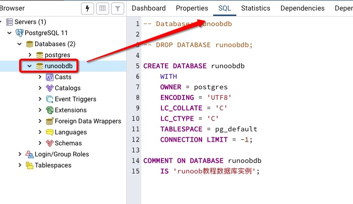

# 資料庫 (Database, DB)

儲存著大量表格以及相關資料庫物件 (tables, views...) 的總合儲存體。每個資料庫都會轉化成特定檔案並儲存在電腦內

## 關聯式資料庫 (Relational Database)

以表格（table）方式來儲存與呈現資料，再以數學集合論為基礎將表格與表格之間建立關聯用以處理複雜的資料關係，SQL 指令就是用於關聯式資料庫
將所有資料儲存在一個表格內會有資料重複問題，如果資料量大會造成浪費儲存空間、資料錯誤率提⾼、增加修改上困難，要解決資料重複的問題，便將一個表格拆成多個表格並透過關聯欄位來做相互的關聯

## 建立一個資料庫

PostgreSQL 建立資料庫可以用以下三種方式：

- 使用 CREATE DATABASE SQL 語句來建立
- 使用 createdb 命令來建立
- 使用 pgAdmin 工具

切換使用者為 postgres，進入 postgreSQL

```ssh
sudo - postgres
```

```sh
~$ psql

postgres=#
```

**CREATE DATABASE** 建立資料庫語法：

```SQL
CREATE DATABASE dbname;
```

**createdb** 建立資料庫語法：

```SQL
createdb [option...] [dbname [description]]
```

說明：

- dbname：要創建的資料庫名稱
- description：關於新創建的資料庫相關的說明
- options：參數可選項

參數選項：

`-D tablespace`：指定資料庫預設的 tablespace
`-e`：將 createdb 生成的命令發送到服務端
`-E encoding`：指定資料庫的編碼
`-l locale`：指定資料庫的語言環境
`-T template`：指定創建此資料庫的模板
`--help`：顯示 createdb 命令的幫助信息
`-h host`：指定伺服器的主機名
`-p port`：指定伺服器監聽的端口，或者 socket 文件
`-U username`：連線資料庫的使用者名稱
`-w`：忽略輸入密碼
`-W`：連接時強制要求輸入密碼

**pgAdmin** 工具建立資料庫，Databases 圖示右鍵 > Create > Database


## 刪除資料庫

PostgreSQL 刪除資料庫可以用以下三種方式：

- 使用 **DROP DATABASE** SQL 敘述來刪除
- 使用 **dropdb** 指令來刪除
- 使用 **pgAdmin** 工具

**DROP DATABASE** 刪除資料庫：

- 會刪除資料庫的系統目錄項並且刪除包含資料的檔案目錄
- 只能由超級管理員或資料庫擁有者執行

```SQL
DROP DATABASE [ IF EXISTS ] name
```

參數說明：

- **IF EXISTS**：如果資料庫不存在則發出提示訊息，而不是錯誤訊息
- **name**：要刪除的資料庫的名稱

**dropdb** 刪除資料庫

- 是 DROP DATABASE 的套件裝器
- 用於刪除 PostgreSQL 資料庫。
- 只能由超級管理員或資料庫擁有者執行

```SQL
dropdb [connection-option...] [option...] dbname
```

參數說明：

- **dbname**：要刪除的資料庫名。
- **options**：引數可選項，可以是以下值：

`-**e` ：**顯示 dropdb 生成的指令併發送到資料庫伺服器
`-**i`：**在做刪除的工作之前發出一個驗證提示
`-**V`：**列印 dropdb 版本並退出
`--if-exists`：**如果資料庫不存在則發出提示訊息，而不是錯誤訊息`
`--**help**`：顯示有關 dropdb 指令的幫助訊息
`-**h host**`：指定執行伺服器的主機名
`-**p port`：**指定伺服器監聽的連接埠，或者 socket 檔案
`-**U username`：**連線資料庫的使用者名稱
`-**w`：**忽略輸入密碼
`-**W`：**連線時強制要求輸入密碼
`-**-maintenance-db=dbname`：**刪除資料庫時指定連線的資料庫，預設為 postgres，如果它不存在則使用 template1

**pgAdmin** 工具刪除資料庫，指定 Database 右鍵 > Delete/Drop


## 選擇資料庫

**資料庫的指令**：

使用 `\l` 用於檢視已經存在的資料庫

```SQL
postgres=# \l
```

使用 `\c` 加上資料庫名來進入資料庫

```SQL
postgres=# \c dbname
```

```sql
psql -h localhost -p 5432 -U postgress dbname
```

**pgAdmin** 工具：



## 備份/還原資料庫

- **pg_dump** 指令來備份整個資料庫

語法：

```sql
pg_dump [option...] [dbname]
```

常用選項參數說明：

`-F` or `--format`：選擇輸出的格式，格式可以為以下選項：
  p：輸出純文本SQL腳本文件（預設）
  t：輸出適合輸入到 pg_restore 裡的 tar 歸檔文件
  c：輸出適於給 pg_restore 用的客製化歸檔。 這是最靈活的格式，它允許對裝載的資料和對像定義進行重新排列，預設是壓縮的
`-f` or `--file`：把輸出發往指定的文件

範例：

```sql
pg_dump -F c -f mydb > mydb.dump
```

- **pg_restore** 指令來還原資料庫

語法：

```sql
pg_restore [option...] dbname
```

常用選項參數說明：

`-d` or `--dbname=` ：與指定資料庫連線並且直接恢復到該資料庫中
`-v` or `--verbose`：輸出比較詳細的訊息

範例：

```sql
pg_restore -d newdb mydb.dump
```

## 綱要 (Schema)

定義了資料庫物件的集合，包含表格、屬性 (fields)、關聯聯性 (relationships)、視圖 (views)、預存程序 (stored procedures) 等資料庫物件

優點：

- 允許多個使用者使用一個資料庫並且不會互相干擾
- 將資料庫物件組織成邏輯組以便更容易管理
- 第三方應用的物件可以放在獨立的 Schema 中，這樣它們就不會與其他物件的名稱發生衝突

建立 SCHEMA 語法：**CREATE SCHEMA**

```SQL
postgres=# create schema myschema;
CREATE SCHEMA
```

輸出結果 "CREATE SCHEMA" 就代表 SCHEMA 建立成功

刪除 SCHEMA 語法：

- 刪除一個空的 SCHEMA：

```sql
DROP SCHEMA myschema;
```

- 刪除一個 SCHEMA 以及其中包含的所有物件：

```sql
DROP SCHEMA myschema CASCADE;
```

## 資料庫正規化

- 建立資料庫內的表格與欄位時所應採⽤的設計法則
- 減少表格內的資料重複過冗
- 增進資料的一致性

正規化種類

1. 第 1 正規化 (First Normal Form, 1NF)：每個欄位內都是儲存單⼀值
2. 第 2 正規化 (Second Normal Form, 2NF)：符合第 1 正規化，非鍵欄位需要與鍵欄位 (主鍵與候選鍵) 有相依性，否則應予移除
3. 第 3 正規化 (Third Normal Form, 3NF)：符合第 2 正規化，非鍵欄位間不應有相依性，否則應予移除

一般建議滿足 3NF 即可，滿足越多正規化，理論上而⾔資料的關聯聯會有更好的約束性；但也導致表格過多、資料更破碎而需要常常合併表格造成執行效能差的結果
