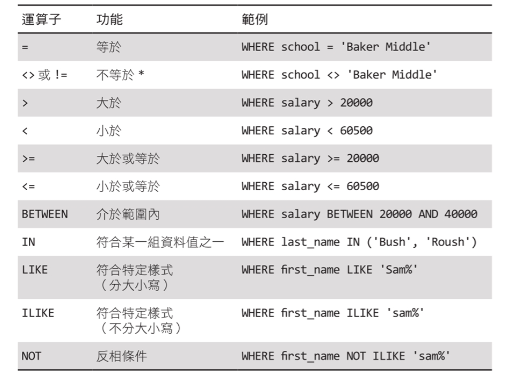

# 資料查詢

## SELECT 概論

- SELECT 基本語法格式

```sql
SELECT column1, column2 ...columnN
FROM table_name;
```

  - column1, column2,...columnN 為表中欄位名
  - table_name 為表名

`*`：查詢表格所有欄位內的值

```sql
SELECT * FROM table_name;
```

`DISTINCT`：查詢結果不會有資料重複情形

```sql
SELECT DISTINCT column1, column2, ...
FROM table_name;
```

`ORDER BY`：將查詢結果排序 

```sql
SELECT column1, column2, ...
FROM table_name
ORDER BY column1, column2, ... ASC|DESC;
```

  - ASC 或不寫都代表升冪排序
  - DESC 代表降冪 

`LIMIT`：只將查詢結果的前幾筆資料列出 

```sql
SELECT column1, column2, ...
FROM table_name
LIMIT n;
```

LIMIT 與 OFFSET 一起使用時的語法， `OFFSET`指定偏移量：

```sql
SELECT column1, column2, ...
FROM table_name
LIMIT n OFFSET m;
```

## WHERE 條件篩選

語法：

```sql
SELECT column1, column2, ...
FROM table_name
WHERE condition;
```

- 搭配運算符號：



- 注意 PostgreSQL 表格內的⽂字值區別大⼩寫，可使⽤`UPPER()`將⽂字轉成⼤寫再比對

範例：

```sql
-- = 等於
SELECT * FROM PUBLISHER 
WHERE PUBLISHER_NAME = 'Pearson';

-- < 小於
SELECT * FROM BOOK
WHERE PRICE < 1000;

-- BETWEEN、AND
SELECT * FROM BOOK
WHERE PRICE BETWEEN 550 AND 1000;

-- LIKE 開頭為任一字元再加上「ear」的資料
SELECT * FROM PUBLISHER 
WHERE PUBLISHER_NAME LIKE '_ear%';

-- LIKE 名稱含有「rei」的資料 (不區別大小寫)
SELECT * FROM PUBLISHER 
WHERE UPPER(PUBLISHER_NAME) LIKE '%REI%';

-- 將⽂字轉成⼤寫再比對
SELECT * FROM PUBLISHER
WHERE UPPER(CONTACT) IN ('PAUL', 'MARY', 'OCEAN');
```

- 搭配邏輯運算
  
  AND, OR語法：

```sql
SELECT column1, column2, ...
FROM table_name
WHERE condition1 AND|OR condition2 AND|OR condition3 ...;
```

  NOT語法：

```sql
SELECT column1, column2, ...
FROM table_name
WHERE NOT condition;
```

- 搭配聚集函式
  
  SUM 加總：

```sql
SELECT SUM(PRICE) AS BOOKS_SUM FROM BOOK 
WHERE UPPER(BOOK_NAME) LIKE '%JAVA%';
```

  AVG 平均：

```sql
SELECT AVG(PRICE) AS BOOKS_AVERAGE FROM BOOK;
```

  COUNT 計數：

```sql
SELECT COUNT(ISBN) FROM BOOK
WHERE PRICE >= 1000;
```

  MAX 最⼤值、MIN 最⼩值：

```sql
SELECT MAX(PRICE) AS BOOK_MAX_PRICE, MIN(PRICE) AS BOOK_MIN_PRICE
FROM BOOK;
```


