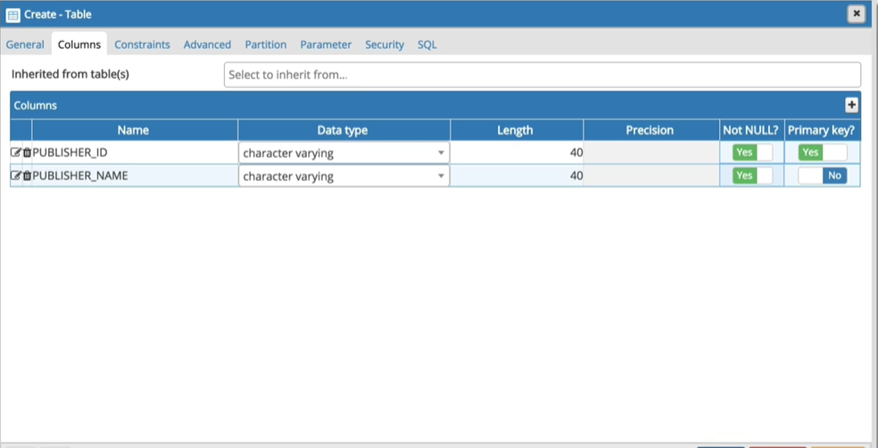

# 表格 (Table)

以欄 (columns) 與列 (rows) 方式來儲存資料

- 主鍵 (Primary Key, PK)：主鍵欄位內的值是**唯⼀不可重複**的，主鍵欄位最好是個**重要的辨識欄位**，所以會設定為 NOT NULL (不可為空值)
- 外來鍵 (Foreign Key, FK)：外來鍵欄位是為了關聯而存在的，外來鍵欄位必須參照到另一個表格的主鍵欄位，以避免多頭馬車，主鍵欄位必須有值，外來鍵⽅可關聯
- 超鍵 (Super Key)：指在一個資料表中，選出兩個或兩個以上的欄位組合起來，以作為唯
一識別資料的欄位，因此，我們可以稱這種組合出來的欄位，就是超鍵
- 候選鍵 (Candidate Key)：候選鍵就是主鍵的候選人，並且也是關聯表的屬性子集所組
成
- 次要鍵 (Alternate Key)：沒被選為主鍵的其他候選鍵

在設計表格的時候，會擁有多個欄位，會先挑選符合唯一性的欄位以及符合最⼩性的欄位作為候選鍵，然後再挑選出主鍵

## 資料類型

- 整數

`smallint`：2 bytes，小範圍整數
`integer`：4 bytes，常用的整數
`bigint`：8 bytes，大範圍整數
`numeric` 以及 `decimal`：使用者自行指定範圍， `scale` 標⽰⼩數位數， `precision` 標示有效位數 (1~1000)

- 文字

`CHAR(n)`：固定長度，空⽩字元填充。n 標⽰字元數而非 bytes
`character varying(n)`：動態長度，⽤在不確定字數但有限度的字數上
`TEXT`：需要儲存極⼤量文字時使⽤ (不確定字數且無限度的字數)

- 日期、時間：

`DATE`：只有日期 (4713 BC ~ 5874897 AD)
`TIMESTAMP`：包含⽇期與時間 (4713 BC ~ 294276 AD)

## 限制 (constraints)

建立或修改表格時欄位皆可加上限制

- 欄位的限制可直接列在欄位後⾯，或是列在所有欄位後面
- 限制可加上名稱，也可不加上名稱 (系統會自動加上)
- pgAdmin：指定表格右鍵 > Properties > Constraints

## 建立表格

- 使用 pgAdmin 圖形化建立表格，Schemas > Tables右鍵 > Create > Table

1. 主鍵：




2. 外來鍵：


- 使用 CREATE TABLE 來建立資料庫表格

1. 主鍵：
   
   語法：
   
```sql
CREATE TABLE table_name (
column1 datatype constraint,
column2 datatype constraint,
column3 datatype constraint,
....
);
```

```sql
-- CREATE TABLE - PK (不想自訂PK constraint名稱，可以直接在欄位後面加PK設定)
CREATE TABLE PUBLISHER (
  PUBLISHER_ID VARCHAR(40) PRIMARY KEY NOT NULL,
  PUBLISHER_NAME VARCHAR(40) NOT NULL,
  CONTACT VARCHAR(40),
  PHONE VARCHAR(40) NOT NULL,
  TIME_INSERT TIMESTAMP DEFAULT CURRENT_TIMESTAMP
);
```

```sql
-- 要建立複合PK或自訂PK constraint名稱必須列在後面
CREATE TABLE PUBLISHER (
  PUBLISHER_ID VARCHAR(40) NOT NULL,
  PUBLISHER_NAME VARCHAR(40) NOT NULL,
  CONTACT VARCHAR(40),
  PHONE VARCHAR(40) NOT NULL,
  TIME_INSERT TIMESTAMP DEFAULT CURRENT_TIMESTAMP,
  CONSTRAINT PK_PUBLISHER PRIMARY KEY (PUBLISHER_ID)
);
```

1. 外來鍵：
   
```sql
-- 不想自訂FK constraint名稱，可以直接在欄位後面加REFERENCES設定
CREATE TABLE BOOK (
  ISBN CHAR(13) PRIMARY KEY NOT NULL,
  BOOK_NAME VARCHAR(200) NOT NULL,
  PRICE NUMERIC(8,2) CHECK (PRICE >= 0),
  AUTHOR VARCHAR(200),
  PUBLICATION_DATE DATE,
  PUBLISHER_ID VARCHAR(40) REFERENCES PUBLISHER (PUBLISHER_ID)
);
```

```sql
-- CREATE TABLE - FK (要自訂FK constraint名稱必須列在後面)
CREATE TABLE BOOK (
  ISBN CHAR(13) PRIMARY KEY NOT NULL,
  BOOK_NAME VARCHAR(200) NOT NULL,
  PRICE NUMERIC(8,2) CHECK (PRICE >= 0),
  AUTHOR VARCHAR(200),
  PUBLICATION_DATE DATE,
  PUBLISHER_ID VARCHAR(40),
  CONSTRAINT FK_BOOK_PUBLISHER
  FOREIGN KEY (PUBLISHER_ID) REFERENCES PUBLISHER (PUBLISHER_ID)
);
```

**外來鍵建立失敗可能原因**：

- 外來鍵與參照到的主鍵，資料類型不相同
- 欲參照 (關聯) 到的欄位不是 PK (或不具有唯一性)
- FK Constraint 的名稱重複
- 外來鍵欄位設定了預設值

可以使用 `\d` 指令來檢視表格是否建立成功， `\d tablename` 檢視表格訊息

## 更改表格

- 新增欄位

```sql
ALTER TABLE BOOK ADD COLUMN LANGUAGE VARCHAR(40);
```

- 欄位更名

```sql
ALTER TABLE BOOK RENAME COLUMN LANGUAGE TO LANGUAGES;
```

- 修改/刪除欄位預設值

```sql
ALTER TABLE BOOK ALTER COLUMN LANGUAGES SET DEFAULT 'Chinese';
ALTER TABLE BOOK ALTER COLUMN LANGUAGES DROP DEFAULT;
```

- 修改欄位類型

```sql
ALTER TABLE BOOK ALTER COLUMN LANGUAGES TYPE VARCHAR(20);
```

- 刪除欄位

```sql
ALTER TABLE BOOK DROP COLUMN LANGUAGES;
```

- 建立 FK

```sql
ALTER TABLE BOOK ADD CONSTRAINT FK_BOOK_PUBLISHER
FOREIGN KEY (PUBLISHER_ID) REFERENCES PUBLISHER (PUBLISHER_ID);
```

- 移除 FK

```sql
ALTER TABLE BOOK DROP CONSTRAINT FK_BOOK_PUBLISHER;
```

- 欄位改為不可/可為空值

```sql
ALTER TABLE BOOK ALTER COLUMN AUTHOR SET NOT NULL;
ALTER TABLE BOOK ALTER COLUMN AUTHOR DROP NOT NULL;
```

## 刪除表格

- pgAdmin，指定表格右鍵 > Delete/Drop


- DROP TABLE 語法

```sql
DROP TABLE tablname;
```

- pgAdmin，指定表格右鍵 > View/Edit Data > All Rows > 新增完成後點擊 Save File 按鈕


- INSERT INTO 用於向表中寫入新資料

**語法**：

```sql
INSERT INTO TABLE_NAME (column1, column2, column3,...columnN)
VALUES (value1, value2, value3,...valueN);
```

column1, column2,...columnN 為表中欄位名
value1, value2, value3,...valueN 為欄位對應的值
範例：

```sql
INSERT INTO PUBLISHER (PUBLISHER_ID, PUBLISHER_NAME, CONTACT, PHONE) 
VALUES 
('P001', 'O''Reilly', 'Ocean' , '02-23456789'), 
('P002', 'John Wiley, Sons Inc', 'Don' , '03-36962869'),
('P003', 'Manning Publications', 'Mary' , '04-43456789'),
('P004', 'Apress', 'Allen' , '05-59876543'),
('P005', 'McGraw-Hill', 'Mike' , '06-69876543'),
('P006', 'Pearson', 'Paul' , '09-98767867'),
('P00X', 'Publisher X', 'X-Man' , '07-75698765'),
('P00Y', 'Publisher Y', 'Yale' , '08-83698765');
```

## 編號

- 自動編號

`SMALLSERIAL`：1 ~ 32767
`SERIAL`：1 ~ 2,147,483,647
`BIGSERIAL`：1 ~ 922,337,2036,854,775,807

**語法**：

```sql
CREATE TABLE table_name(
id SERIAL PRIMARY KEY NOT NULL
);
```

範例：

```sql
CREATE TABLE PURCHASE (
  PURCHASE_ID SERIAL PRIMARY KEY NOT NULL,
  ISBN CHAR(13) NOT NULL,
  QUANTITY INT NOT NULL,
  PURCHASE_DATE DATE NOT NULL DEFAULT CURRENT_DATE,
  CONSTRAINT FK_PURCHASE_BOOK 
  FOREIGN KEY (ISBN) REFERENCES BOOK (ISBN)
);
```

- 查詢當前編號

**語法**：

```sql
SELECT currval (pg_get_serial_sequence('table_name','column_name'));
```

## 修改資料

- pgAdmin，指定表格右鍵 > View/Edit Data > All Rows > 修改完成後點擊 Save File 按鈕
- UPDATE 用來修改資料表，可以同時更新一個或者多個欄位，亦可以在 WHERE 子句中指定任何條件

**語法**：

```sql
UPDATE table_name
SET column1 = value1, column2 = value2...., columnN = valueN
WHERE condition ;
```

範例：

```sql
UPDATE PUBLISHER SET CONTACT = 'Mary'
WHERE PUBLISHER_ID = 'P00X';
```

## 刪除資料

- pgAdmin，指定表格右鍵 > View/Edit Data > All Rows > 修改完成後點擊 Save File 按鈕
- DELETE 用來刪除資料表中的資料

    **注意**：被外來鍵參照到的資料無法刪除

**語法**：

```sql
--依照條件刪除
DELETE FROM table_name
WHERE condition;

--全部資料刪除
DELETE FROM table_name
```

範例：

```sql
--依照條件刪除
DELETE FROM PUBLISHER 
WHERE PUBLISHER_ID = 'P00X' OR PUBLISHER_ID = 'P00Y';

--全部資料刪除
DELETE FROM BOOK;
```