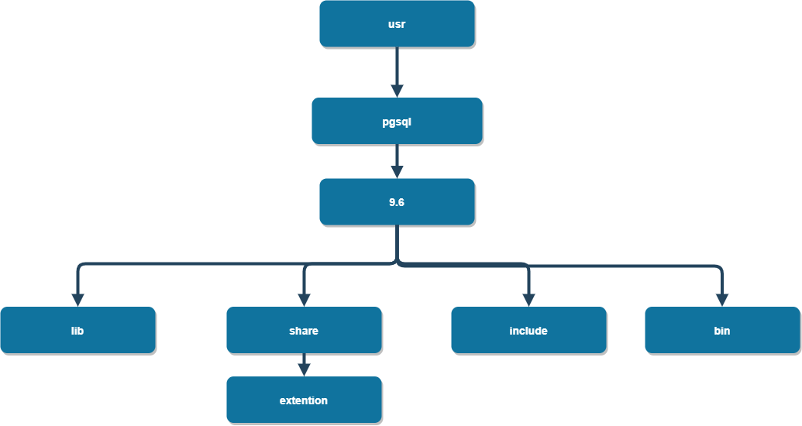
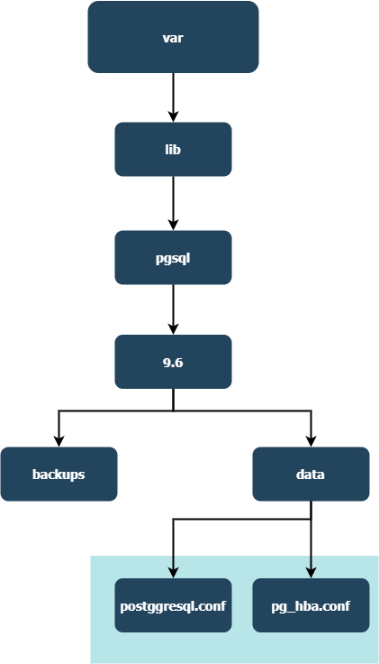

# PostgreSQL 安裝與配置

PostgreSQL 96 on CentOS 8  
<https://www.postgresql.org/>

## Install

- 列出可用的 PostgreSQL 安裝包

```sh
dnf module list postgresql
```

```sh
CentOS-8 - AppStream
Name          Stream    Profiles              Summary                                                 
postgresql    10 [d]    client, server [d]    PostgreSQL server and client module                     
postgresql    9.6       client, server [d]    PostgreSQL server and client module 
```

輸出顯示 postgresql 安裝包可用有兩個。每個都有兩個配置文件：sever 和 client。<br>
- CentOS 8 預設安裝是  `postgresql 10`

- 若要安裝 `postgresql 9.6` 如下

```sh
sudo dnf module install postgresql:9.6
```

- 安裝 `contrib` 軟件包，該軟件包為 PostgreSQL 資料庫提供了一些附加功能

```sh
sudo dnf install postgresql-contrib
```

## 官網 RPM 安裝包

- 只安裝 server
 
rpm 下載網址：<https://www.postgresql.org/>

```sh
dnf install https://download.postgresql.org/pub/repos/yum/reporpms/EL-8-x86_64/pgdg-redhat-repo-latest.noarch.rpm
dnf -qy module disable postgresql
dnf install postgresql96-server
```

```sh
dnf -y install postgresql96-contrib
```

```sh
/usr/pgsql-9.6/bin/postgresql96-setup initdb
systemctl enable postgresql-9.6
systemctl start postgresql-9.6
```
安裝好之後lib目錄存放位置



安裝好之後 config 目錄存放位置



## Config

`postgresql.conf`

- listen_addresses = '*'
- max_connections = 500
- superuser_reserved_connections = 3
- tcp_keepalives_idle = 60
- shared_buffers = 4096MB
- temp_buffers = 16MB
- work_mem = 32MB
- shared_preload_libraries = 'pg_stat_statements'
- log_line_prefix = '%m %h %u %d: '

```sh
export POSTGRESQL_CONF='/var/lib/pgsql/9.6/data/'
```

```sh
sed -i "/listen_addresses/s/^#//" ${POSTGRESQL_CONF}postgresql.conf
sed -i "/listen_addresses/s/localhost/*/" ${POSTGRESQL_CONF}postgresql.conf
sed -i "/max_connections/s/[[:digit:]]\+/500/" ${POSTGRESQL_CONF}postgresql.conf
sed -i "/superuser_reserved_connections/s/^#//" ${POSTGRESQL_CONF}postgresql.conf
sed -i "/tcp_keepalives_idle/s/^#//" ${POSTGRESQL_CONF}postgresql.conf
sed -i "/tcp_keepalives_idle/s/[[:digit:]]\+/60/" ${POSTGRESQL_CONF}postgresql.conf
sed -i "/^shared_buffers/s/= [[:digit:]]\+MB/= 4096MB/" ${POSTGRESQL_CONF}postgresql.conf
sed -i "/temp_buffers/s/^#//" ${POSTGRESQL_CONF}postgresql.conf
sed -i "/temp_buffers/s/= [[:digit:]]\+MB/= 16MB/" ${POSTGRESQL_CONF}postgresql.conf
sed -i "/^[#]\{0,1\}work_mem/s/^#//" ${POSTGRESQL_CONF}postgresql.conf
sed -i "/^work_mem/s/= [[:digit:]]\+MB/= 32MB/" ${POSTGRESQL_CONF}postgresql.conf
sed -i "/^[#]\{0,1\}shared_preload_libraries/s/^#//" ${POSTGRESQL_CONF}postgresql.conf
sed -i "/^shared_preload_libraries/s/''/'pg_stat_statements'/" ${POSTGRESQL_CONF}postgresql.conf
sed -i "/^log_line_prefix/s/'.*'/'%m %h %u %d: '/" ${POSTGRESQL_CONF}postgresql.conf
```

audit

```sh
sed -i '$a\pgaudit\.role = '"''" ${POSTGRESQL_CONF}postgresql.conf
sed -i '$a\pgaudit\.log = '"''" ${POSTGRESQL_CONF}postgresql.conf
sed -i '$a\pgaudit\.log_catalog = off' ${POSTGRESQL_CONF}postgresql.conf
```

```sh
su - postgres
psql
```

```sql
create database nextec;
\c nextec
alter role postgres set pgaudit.log = 'read, write, ddl';
alter role postgres set pgaudit.role = 'postgres';

CREATE USER uforduserjoy WITH
	LOGIN
	NOSUPERUSER
	NOCREATEDB
	NOCREATEROLE
	INHERIT
	NOREPLICATION
	CONNECTION LIMIT -1
	PASSWORD '1q2S#c4r5G^n';
GRANT CONNECT ON DATABASE nextec TO uforduserjoy;
GRANT USAGE ON SCHEMA public TO uforduserjoy;
GRANT ALL PRIVILEGES ON ALL TABLES IN SCHEMA public TO uforduserjoy;
GRANT ALL PRIVILEGES ON ALL SEQUENCES IN SCHEMA public TO uforduserjoy;
alter role uforduserjoy set pgaudit.log = 'read, write, ddl';
alter role uforduserjoy set pgaudit.role = 'uforduserjoy';

CREATE USER ufoappuser WITH
	LOGIN
	NOSUPERUSER
	NOCREATEDB
	NOCREATEROLE
	INHERIT
	NOREPLICATION
	CONNECTION LIMIT -1
	PASSWORD 'ufo=RELuvu9527';
GRANT CONNECT ON DATABASE nextec TO ufoappuser;
GRANT USAGE ON SCHEMA public TO ufoappuser;
GRANT ALL PRIVILEGES ON ALL TABLES IN SCHEMA public TO ufoappuser;
GRANT ALL PRIVILEGES ON ALL SEQUENCES IN SCHEMA public TO ufoappuser;
alter role ufoappuser set pgaudit.log = 'read, write, ddl';
alter role ufoappuser set pgaudit.role = 'ufoappuser';
\q
```

`pg_hba.conf`

```
host    nextec          uforduserjoy                127.0.0.1/32    md5
host    nextec          ufoappuser              192.168.10.0/24        md5
```

```sh
# /usr/pgsql-9.6/bin/pg_ctl reload
systemctl start postgresql-9.6
```

## Restore

```sh
s3cmd get $(s3cmd ls s3://mgmt/dbdumps/ | tail -1 | awk '{print $4}') /var/lib/pgsql/9.6/nextec.backup
chown postgres:postgres /var/lib/pgsql/9.6/nextec.backup
su - postgres
pg_restore -d nextec -v /var/lib/pgsql/9.6/nextec.backup && rm /var/lib/pgsql/9.6/nextec.backup
```

## Backup

```sh
mkdir -p /opt/dbdumps
chown -R postgres:postgres /opt/dbdumps
cat > /opt/dbdumps/dbdump.sh << "EOF"
#!/bin/bash

S3CMD='/usr/bin/s3cmd'
DB='nextec'
FILENAME_PATTERN='backup$'
S3_PATH='s3://mgmt/dbdumps'
S3_KEEP=30
S3_DEL_FILE_LIST=''
LOCAL_PATH='/opt/dbdumps'
LOCAL_KEEP=3
LOCAL_DEL_FILE_LIST=''

_time=`date +%Y%m%d-%H%M%S`
DB_BACKUP_FILENAME="$LOCAL_PATH/$_time.backup"

# dump db
function backup_db() {
    su -m -s /bin/sh postgres -c "pg_dump -F c -b -v -f $DB_BACKUP_FILENAME $DB"
    chmod o= $DB_BACKUP_FILENAME
}

# upload backup-file to s3
function upload_s3() {
    $S3CMD put $DB_BACKUP_FILENAME $S3_PATH/
}

function get_local_del_file_list() {
    file_count=`ls -lv $LOCAL_PATH/ | grep ${FILENAME_PATTERN} | wc -l`
    del_count=$[file_count-LOCAL_KEEP]
    if [[ $del_count -gt 0 ]]; then
        LOCAL_DEL_FILE_LIST=`ls -v $LOCAL_PATH/ | grep ${FILENAME_PATTERN} | head -$del_count`
    fi
}

function get_s3_del_file_list() {
    file_count=`$S3CMD ls $S3_PATH/ 2>/dev/null | grep ${FILENAME_PATTERN} | wc -l`
    del_count=$[file_count-S3_KEEP]
    if [[ $del_count -gt 0 ]]; then
        S3_DEL_FILE_LIST=`$S3CMD ls $S3_PATH/ 2>/dev/null | grep ${FILENAME_PATTERN} | awk '{print $4}' | sort -V | head -$del_count`
    fi
}

echo "dump db..."
backup_db
echo "dbdump: $DB_BACKUP_FILENAME"

echo
echo "upload file to s3..."
upload_s3
echo

get_local_del_file_list
if [[ $LOCAL_DEL_FILE_LIST ]]; then
    for f in $LOCAL_DEL_FILE_LIST
    do
        rm -f $LOCAL_PATH/$f
        echo "delete local file..."
        echo "delete: $LOCAL_PATH/$f"
    done
fi

get_s3_del_file_list
if [[ $S3_DEL_FILE_LIST ]]; then
    for f in $S3_DEL_FILE_LIST
    do
        echo "delete remote file..."
        $S3CMD del $f
    done
fi
echo
EOF
chmod 750 /opt/dbdumps/dbdump.sh
```

```sh
echo "10    2   *   *   *   root    /opt/dbdumps/dbdump.sh" >> /etc/crontab
```
